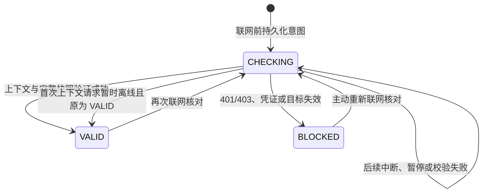

# 儿童端临时访问宿主与交互契约

## 范围

本阶段将已实现的设备身份、签名基础配置、临时访问 SDK 和加密文件库接入 Android 儿童端。规则页提供只读状态、原截止时间、问题说明及同步操作。所有记录仍为 `CONFIGURE_ONLY`、`quotaEffect=UNCHANGED`；保存或服务确认不表示其他应用已解锁，不增加使用额度。

设备主动申请入口、受管设备系统执行、启动恢复与后台调度属于后续阶段；本宿主只在前台同步。普通应用不能因此获得防卸载、阻止强制停止或系统级跨应用控制能力。

## 数据与信任

1. 部署固定服务地址、签发者和可信公钥；儿童不能在界面修改。
2. 每次联网通过独立设备凭证读取固定 `device-api/access-context`，校验租户、设备及注册，并获取服务端认证的档案标识。禁止从未验证文档或儿童输入推断档案。
3. 基础配置每次恢复重新验签，精确匹配策略与基础版本、应用及请求的全部源规则 ID。实际下发规则是编译后的 `RuleEvaluation`：用 `sourceRuleIds` 定位，读取 `predictedEffect`；不按编辑规则的 `id/effect` 解析，也不将预测结果当成系统执行结果。
4. 仅支持基础规则允许临时例外的 APP_LAUNCH/DENY 或 TIME_WINDOW/ALLOW。应用必须为 PRIMARY，受保护包不能例外；缺失、版本变化或歧义均拒绝匹配。
5. SDK 验证完整签名、目标范围、文档版本、原截止与单调时间下限；宿主不直接查询 SDK 私有表。只读快照提供保存、待回执、拒绝、基础变化、到期和撤回状态。

## 持久化状态机

上下文存入已有 Android 安全存储，键绑定服务地址、签发者、租户、设备和注册。JSON 严格限制字段、范围及容量，不存设备凭证或私钥。

- VALID 才允许恢复该范围的已验签记录；离线无法获知新的撤回，仍受原截止限制。
- 同步中断时保留 CHECKING，不自动复活旧记录。再次在线完整核对后恢复。
- BLOCKED 不回退到旧的本地授权；跨进程重开仍停止展示。
- 单条记录失败会持久保留请求 ID 为“需要重新核对”，仅成功重新观察该请求才能清除。分页未覆盖的请求不会被误清除。
- 上下文损坏、缺失密钥、错误密钥、文件损坏和时间回退不自动删除或重建用户数据。
- 临时访问文件复用 Sembast 事务与 PointyCastle AES-256-GCM，显式 `DatabaseMode.create`。这不提供硬件防回滚保证。

## 会话与交互

| 事件 | 行为 |
| --- | --- |
| 首次进入/身份变为可用 | 恢复对应范围，前台核对；不从儿童输入建立范围 |
| 切后台 | 取消网络、隐藏旧状态、停止到期刷新；晚到结果不能发布 |
| 回前台 | 身份检查后重新同步，原截止不变 |
| 身份或注册改变 | 关闭旧接收器及数据库，清空旧界面，不枚举其他档案 |
| 原截止到达 | 本地立即改为到期，再读日志；不自动请求延长或重复发送业务命令 |
| 基础规则更新 | 重新验签并刷新临时安排的基础匹配状态 |
| 失效/错误 | 固定中文说明，可显示安全请求关联号，不展示原始响应、凭证或 JWS |

规则页按记录展示应用、状态和原截止。详情说明按设备本地时间显示、离线/重启/重试不延长以及当前系统执行边界。支持窄屏、大字、键盘焦点与激活；每次展示最多八条，逐批展开。加载和不可用按钮禁用，未完成分页可继续同步。

儿童只能查看及同步，不能批准、改变范围、延长期限、清空安全记录或伪造系统执行回执。管理员恢复与解除管理仍走既有成人授权流程。

## 验证层次与发布边界

- 单元/组件：真实签名、加密文件重开、原期限、拒绝后重开、单条问题持久化、暂停、时间故障、窄屏大字和实际 App 导航。
- 真实 HTTP：Spring 随机回环端口、真实设备凭证认证及签名文档，五个独立 Flutter 进程接收/撤回/到期/凭证撤销/阻断恢复。基础配置也由真实 HTTP 下发，禁止在该夹具构造模拟基线。
- HTTP 夹具的成人 JWT/MFA、已激活设备和本地加密测试密钥是明确替代物；不代表真实 OTP、Android 安全存储或设备注册已通过该项验收。
- 浏览器仅构建公开、无凭据的组件夹具，验证渲染与详情交互；生产入口仍要求 Android 平台能力。
- 原生构建只能证明编译兼容；访问上下文/新密钥路径的原生跨进程存储、真实电视遥控器、受管 EMM 与系统执行必须单独验收。
- 日志容量仍有上限，不承诺无限历史；记录清理策略、密钥轮换和后台调度需独立设计验证。

最终源码摘要、命令结果与能力限制见 `releases/stage-access-host-verification.json`。

### 复现入口

在 `packages/device_access` 运行 `dart test` 与 `dart analyze`，在 `apps/child` 运行 `flutter test` 与 `flutter analyze`。实际 HTTP 夹具由后端测试创建并删除临时凭证文件，不手工传递凭证参数。

后端 `mvn verify` 必须显式设置以下安装/包路径参数，才能包含本阶段真实互通；只运行未启用这些参数的测试不能宣称通过该项验收：

| 参数 | 值的含义 |
| --- | --- |
| `device.dart.command` | 本机 Dart 可执行程序 |
| `device.flutter.command` | 本机 Flutter 可执行程序 |
| `device.access.package` | 冻结候选的 `packages/device_access` 绝对路径 |
| `device.child.package` | 同一候选的 `apps/child` 绝对路径；启用五个 Flutter 子进程 |
| `device.identity.package`、`device.policy.package` | 同一候选对应身份/基础配置 SDK 路径 |
| `observation.device.package`、`observation.guardian.package` | 同一候选使用情况 SDK 与监护端路径 |

组件预览单独使用 `tool/access_preview.dart` 构建 Web，限定回环地址提供静态页面，再运行 `scripts/tests/child-access-ui.cjs`。该入口是公开验收夹具，不能作为生产儿童端部署。
