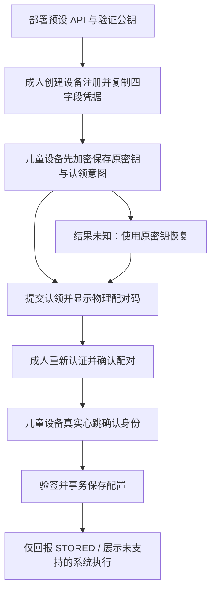

# 儿童端 Flutter / Android 宿主契约与阶段交付

更新：2026-10-09。对应 `apps/child`、[身份协议](device-identity-client-contract.md)、[签名配置协议](device-configuration-client-contract.md)。这是完整智能管家中的一阶段实现，不宣称所有设备管控、商业化和生产发布已完成。

## 1. 产品流程与权限

| 页面 / 状态 | 实际操作 | 不授予的权限 |
|---|---|---|
| 尚未部署 | 说明交付配置、打开帮助 | 修改服务地址或注入信任密钥 |
| 首次连接 | 设备名称、粘贴完整注册凭据、本地校验 | 创建儿童档案、管理员确认 |
| 等待确认 | 八位物理配对码、检查真实心跳 | 本地确认配对或获取成人令牌 |
| 认领结果未知 | 原密钥恢复；服务器明确未找到时显式原票据重试 | 静默新建身份、无界重试 |
| 已连接 | 设备 / 规则 / 帮助，手动同步、连接维护 | 编辑策略、修改额度、授予系统权限 |
| 读取失败 | 停止新注册入口，重新读取本地身份 | 自动删除、重置或重新生成私钥 |
| 认证拒绝 / 凭据过期 | 显示连接需要检查；保留已有状态 | 假称连接正常或将拒绝视作永久解绑 |
| 轮换未完成 | 展示待完成提示与当前阶段可用的确认/取消操作 | 激活结果未知时回退旧凭据 |

服务地址与公钥为部署输入；票据严格只有四个字段且限 8192 字符。规则来源、设备、租户及注册周期绑定仍由协议组件严格验证。前后台切换清除粘贴输入并隐藏配对码；无后台自动采集、摄像头权限或儿童管理员入口。

## 2. 实现分层与成熟组件

| 层 | 实现 / 选择 |
|---|---|
| 交互 | Flutter Material 3、中文本地化、手机窄屏/大字体/宽屏布局、语义标题、键盘和遥控选择焦点 |
| 状态编排 | ChildSession + Flutter ChangeNotifier；只编排现有协议，不重复实现身份状态机 |
| 身份协议 | DeviceIdentityManager / http / jose / uuid，复用已有严格恢复与轮换契约 |
| 安全存储 | flutter_secure_storage 10.0.0，Android Keystore 包装密钥 + SDK 加密完整身份记录 |
| 原生胶水 | Kotlin MethodChannel；插件 apply 后依次 commit 包装密钥、配置、数据偏好文件 |
| 配置接收 | device_policy / JOSE 验签 / Sembast 应用私有数据库，页与回执事务恢复 |
| 诊断 | logging，固定错误码；不输出凭据、配对码、JWK、原始响应或用户粘贴输入 |

Flutter 3.22 的本地化固定 collection 1.18；因此将 device_policy 的 http_parser 下界放宽为 ^4.0.2，儿童宿主解析为 4.0.2。不强制 dependency overrides，不变更协议。

核心依赖许可证依据锁定包 LICENSE：Flutter/Dart、flutter_secure_storage、http、sembast、path/path_provider、logging、cupertino_icons 和 jose 使用 BSD 风格许可证；uuid 为 MIT。完整传递依赖 SBOM、再分发 NOTICE 与漏洞扫描仍须在发布流水线执行，不能以此表替代。

## 3. Android 耐久存储与失败处理

1. 单进程、单 manager、单完整加密身份记录；当前无并行后台身份服务。
2. SDK resetOnError=false；错误不得清空已有身份。v10 首次无算法标记也进入算法迁移，使用其 migrateOnAlgorithmChange=true 数据保留流程。此次真实空白安装发现该差异，不能只凭 mocked MethodChannel 判定 SDK 可用。
3. 插件写入实际使用 SharedPreferences.apply。读取也可能触发初始化/迁移；读写完成后都通过原生通道依次对 FlutterSecureKeyStorage、FlutterSecureStorageConfiguration、aimanager_identity_v1 commit 新屏障标记，确认先前 apply 完成。任一失败返回稳定存储错误，阻止协议继续发出新请求。
4. 不自行实现密码算法、不关闭迁移错误、不自动恢复默认密钥。插件版本和偏好文件名存在耦合，升级必须检查源码并重跑首次安装、升级、进程中断、丢失密钥及失败恢复检查。
5. 禁用备份与设备传输恢复，敏感窗口使用 FLAG_SECURE。它们不等于 root 防护、硬件不可导出密钥、远程证明或防卸载。
6. 当前软件签名私钥作为加密 JWK 保存；操作系统墙钟附回拨检测，不是可信硬件计时。多进程排他锁、硬件签名提供者和受管生命周期适配仍待实现。

## 4. 配置、离线与能力边界

- 签名配置只接受 CONFIGURE_ONLY。缓存、游标、待补交 STORED 回执来自真实本地数据库；发送回执失败后重新读取已提交事实，不显示错误的旧游标。
- 配置公钥/发行方缺失时明确提示部署管理员处理，不信任消息自带密钥。存储恢复重新验签；未收到配置为空态，不填充示例儿童数据。
- 离线保留身份与最后保存配置，不自动延长票据/临时通行、不静默注册。尚未实现系统策略执行，因此不能将缓存意图称作已拦截应用。
- 普通 Android 家庭模式当前 systemEnforced=false。没有 DPC、设备所有者、Accessibility、UsageStats、VPN、摄像头或开机接收器；不能防卸载、阻止强制停止或承诺重启自动施加限制。
- TV 提供 Leanback 启动入口和遥控焦点基础；当前仅宽屏 widget 焦点验证，尚未做实体电视/Android TV 系统镜像、厂商策略和受管注册认证。
- Web 仅预览，输入与连接均禁用；不能存储身份。iOS/Windows/macOS 仍需各自安全存储、系统策略 API 与资质审核。

## 5. 构建与部署

已使用 Flutter 3.22.2 / Dart 3.4.3；Java 17、compileSdk 36、minSdk 24、NDK 27.0.12077973；AGP 8.13.1、Kotlin 2.1.0、Gradle 8.13。官方 Gradle 分发 SHA-256 固定为 20f1b1176237254a6fc204d8434196fa11a4cfb387567519c61556e8710aed78，wrapper 网络超时 30 秒。

项目限制 Gradle 堆 1536 MiB、2 workers、关闭并行、Kotlin 同进程。此次原先默认 4 GiB 导致本机 native malloc 失败，降低资源后成功；这些是可调构建参数，不是产品运行内存承诺。

部署字段与发布签名见 [儿童端 README](../apps/child/README.md)。HTTPS 为默认要求；仅 debug 可显式允许回环 HTTP，release 拒绝该开关且必须外置正式签名。当前 targetSdk 由已安装 Flutter 版本给出；未完成商店目标 API 合规，不是可直接上架的发布包。

## 6. 本阶段验收与证据

以下均为本阶段实际运行结果；构建成功和 mock 测试不等同真实系统策略验收。

| 验证 | 实际结果 / 边界 |
|---|---|
| Flutter analyze | 通过，无问题 |
| Flutter 单元与 widget | 16 项通过：票据/部署输入、存储屏障、等待确认、未知认领恢复、前后台遮盖、过期/认证拒绝、读取失败、轮换、配置回执失败恢复、窄屏大字体和宽屏焦点 |
| 配置 SDK 兼容回归 | 58 项通过；隔离快照固定 http_parser4.0.2 / collection1.18；测试工具 shelf1.4.2 与旧 parser 不相容，临时测试图固定 shelf1.4.1。生产没有添加 overrides |
| 真实 Android 持久化 | API34 专用模拟器：全新安装写入 → 结束进程并确认停止 → 保留安装重新启动；加密身份、私钥实际签名、原生 Sembast 文件恢复通过。云端为受控替身，不作为原生生产后端联调证明 |
| 产品 APK | 普通 lib/main.dart 入口 debug 构建通过（27.4 秒）；安装并冷启动后，原生首屏及帮助打开/关闭通过；测试身份已从专用调试安装移除 |
| Web 构建 | 最终源代码 release/html 构建通过（50.9 秒），只读预览 |
| Chrome 实际交互 | 390×844 / 1280×900 均无横向溢出、无页面错误；连接禁用、能力提示、帮助打开/关闭通过 |

普通 APK 首次检查曾被模拟器 System UI 无响应弹窗遮挡，选择“等待”后恢复并完成原生交互检查。未将此环境问题隐去，也未据此宣布实体设备稳定性认证；长时运行、真机、低内存和 TV 兼容仍待专项验证。

本地产品 APK 为 `.local/releases/child-host/app-debug.apk`，SHA-256：`318937fcaf27abc86a21a5d7f4997ea9dad7996c9fa6e0e441e5107ea742b042`。产物不提交 Git；当前未配置生产地址，启动显示交付配置提示。正式部署应按 README 构建指定地址与公钥版本。

可重复浏览器检查：在 `scripts/tests` 安装锁定的 Playwright 依赖，运行 `node child-ui-journey.cjs`。默认连接本机 8175 的公开预览，只接受回环 HTTP 地址，可通过 CHILD_PREVIEW_URL 指定端口；不会输入成人或设备凭据。此用例要求预览编译时预设公开示例地址，以显示连接页面及浏览器限制说明。

设计目标与实际公开预览：

- [第二版设计稿](design/child/concept-v2.png)
- [手机浏览器截图](design/child/browser-mobile.png)、[宽屏浏览器截图](design/child/browser-desktop.png)
- [浏览器结果](design/child/browser-qa.json)
- [阶段验收摘要](design/child/verification.json)

12ui 第三方托管生成被自动审批拒绝（未授权传送产品简报），因此未继续调用该目的地；使用本对话内置图像生成形成设计目标。IAB 内核两次失败后，实际浏览器检查使用 Playwright 与本机 Chrome。截图仅为无凭据 Web 预览；受保护的 Android 原生窗口不采集敏感截图。

## 7. 后续完整目标

继续实施：可信计时与使用量、受管 Android / EMM 能力适配、实际应用和系统权限策略、启动恢复、TV 厂商认证、额度/临时通行执行、内容安全、设备解绑恢复、可选识别与授权撤回、商业订阅/租户运维、性能与安全发布门槛。各项必须有真实系统能力和执行回执，不能用此阶段配置保存替代。
