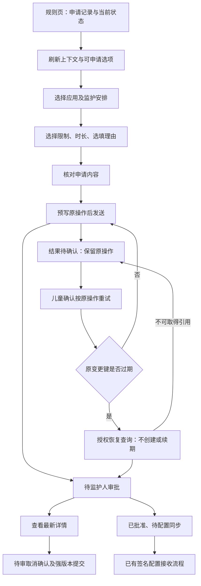

# 儿童端临时访问申请：会话与产品交互

## 1. 交付与入口

Android 正式入口为 `main.dart → ChildSession → ChildSubmissionReceiver`，复用设备 opaque 凭证、原生安全绑定、既有 AES-GCM 文件库与 SDK 原操作日志。Flutter Material 3 实现界面，没有新增生产框架、身份方案或数据库。已连接设备在「规则 → 临时访问申请」发起工作流；浏览器正式入口仍不提供设备注册和身份存储。

会话串行处理操作。启动、恢复前台、检查连接时仅刷新上下文、可申请选项和申请事实；创建、取消、未知结果重试和放弃均须明确操作。新创建/取消生成独立随机键；重试沿用持久日志里的原键、原正文、原取消版本。状态和错误使用独立通道，不把申请失败误报为设备配对失败。

## 2. 交互流程

| 页面/状态 | 用户操作 | 约束 |
| --- | --- | --- |
| 申请列表 | 刷新、继续查找应用、继续加载申请、查看详情 | 标明本轮核对或上次保存；缓存有界，不声称已加载全部历史 |
| 应用选择 | 搜索应用/安排、选择、显示更多 | 保留同一应用在不同监护安排下的独立选项；空过滤页有游标时可继续查找 |
| 申请表单 | 时长、限制、理由、核对 | 界面为 1–60 整分钟；服务端协议仍支持 1–3600 秒。限制 1–20 条，理由按 UTF-16 至多 300 单元 |
| 提交确认 | 返回修改、提交给监护人 | 显示应用、安排、时长、限制数量与理由；尚未确认时不写入或发起申请 |
| PREPARED | 确认并发送原操作、确认放弃 | 原操作从未发送，放弃只删除本地意图 |
| UNKNOWN | 按原操作重试并再次确认 | 不能放弃、替换或另起申请；查询不到历史引用仍保留 UNKNOWN |
| REJECTED | 查看可解释原因、确认放弃 | 只允许已知明确拒绝；不得把认证失败、5xx 或过期键归入此态 |
| 待审详情 | 核对详情、取消确认、保留申请 | 仅本轮已确认、未过待审期限、无未解决操作时可取消；确认期间版本变化须重新核对 |
| 已批准/其他终态 | 查看状态、原截止、理由 | 待审批、批准待同步、拒绝、取消、到期、撤回、失效分别显示；不显示“已解锁” |

批准与原有「临时访问配置」区分开呈现。申请页不修改基础策略、不执行成人审批、不增加额度，也不能把服务端事实当作原生执行证据。待审期限已到而服务端仍返回 PENDING 时提示刷新核对，不在客户端伪造状态迁移。

## 3. 隐私与生命周期

- 进入后台立即清空可见申请快照，暂停宿主传输并改变会话代际；迟到的响应不发布。申请表单、理由和详情的私人组件树被移除，对话框关闭，前台返回后需要重新进入。
- 凭证不可读、认证拒绝、主体/设备/注册范围改变时不恢复旧范围缓存；关闭接收器不删除加密文件、未解决意图或原键。凭证正常轮换不改变注册范围的归属。
- 可恢复网络故障可以展示经绑定核对的旧缓存，并明确标记未在线核对。创建入口依赖本轮在线选项；未知操作的恢复由专用流程处理。
- 诊断仅显示受限错误码对应说明及关联编号，日志不包含理由、原键、设备凭证和请求正文。问题编号不能替代监护人认证。
- 界面隐藏与测试不等同于操作系统截图防护、硬件不可导出密钥或可靠后台执行；这些能力须按平台模式继续验收。

## 4. 视觉、易用与输入

沿用 [儿童端设计稿](design/child/concept-v2.png) 的白底、深蓝标题、简洁分区、可解释提示和 48dp 按钮。申请区以状态和下一步为主，避免把审批流程画成系统管控成功。手机表单使用可滚动对话框，宽屏限制内容宽度；操作按钮允许换行，支持放大字体。

应用选项合并名称、监护安排和点击动作的可访问性语义，并明确为按钮。应用选择提供初始焦点；对话框支持方向键与电视选择键。时长与理由沿用平台输入法。当前检查证明 Flutter 焦点与选择路径，不代表所有电视厂商、遥控器或输入法均已兼容。

12ui 技能曾实际执行并收到服务地区拒绝，未宣称生成新的托管设计或完成托管像素对齐。此阶段基于已交付设计扩展，以实际渲染和行为检查记录结果。

## 5. 验收边界与后续

当前阶段覆盖会话恢复、未知结果、身份失败、前后台迟到响应、分页、提交/取消/放弃确认、字段约束、小屏放大字体、键盘/方向键/选择键和可访问性。浏览器预览 `tool/submission_preview.dart` 明确使用公开合成内存夹具；正式入口不引用它。原生安全文件与真实后端协议的已有证据分别见前序契约，不能把不同夹具合并声称为完整真机端到端。

后续仍须完成真实 Android 新申请流程的跨进程恢复、真实 Spring 与产品会话/页面联调、电视厂商输入兼容、后台可靠性与受管系统执行。管理员生产 MFA、EMM 商用准入、OceanBase 目标版本验证及全平台路线图继续作为独立发布门槛。

本阶段具体数量、构建产物及源码/日志哈希见[阶段验收记录](releases/stage-submission-ui-verification.json)；流程语义见[持久日志与宿主契约](child-request-workflow-contract.md)、[设备接口](device-access-submission-contract.md)。
