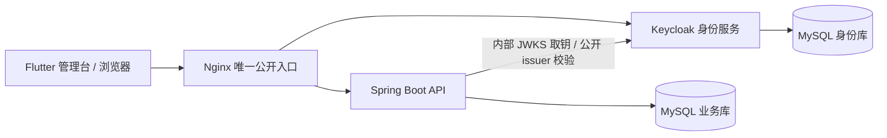

# 可复制部署与运行手册

## 范围与组件

交付版本使用 Docker Compose、官方 MySQL 8.4、Keycloak、Eclipse Temurin 17 和 Nginx；Flutter 与 Maven 在宿主/CI 构建独立源码快照。业务数据库和身份数据库分开，现有 `.local/runtime/` 不参与新环境部署。

默认是回环地址上的单机部署验证环境。Compose 不代表数据库高可用、百万设备容量或全球多区域已经验收。生产仍须完成 TLS、备份恢复、供应链、容量及区域发布门槛。

| 文件 | 职责 |
|---|---|
| `deploy/compose/compose.yaml` | 五服务、健康依赖、独立持久卷、网络与文件凭据 |
| `deploy/compose/compose.tls.yaml` | 替换 HTTP 发布端口并挂载证书 |
| `deploy/containers/` | 从已验证产物生成应用镜像，优化 Keycloak 镜像 |
| `deploy/edge/` | API/身份反向代理、Flutter 路由回退、动态服务 DNS、脱敏访问日志 |
| `deploy/keycloak/realm-template.json` | 无用户/密码的身份模板、PKCE、API audience、条件建空间 scope、实际认证方法 |
| `scripts/initialize-deployment.ps1` | 生成独立凭据、系统 API 生成 P-256 密钥、限制目录权限、不覆盖已有环境 |
| `scripts/build-deployment.ps1` | 独立源码快照、全后端/管理台/组件验证、唯一产物目录、哈希清单 |
| `scripts/start-deployment.ps1` | 核对产物及 Compose 指向，再启动指定项目并等待健康 |



Compose secrets 采用文件挂载，环境配置只有文件路径。业务密码通过 Spring Boot `configtree:` 读取；Keycloak 的包装入口在容器内读取凭据后启动官方服务。文件挂载不会自动提供静态加密，部署目录的权限和磁盘保护仍由环境承担。[Compose secrets](https://docs.docker.com/compose/how-tos/use-secrets/)、[Spring Boot 配置树](https://docs.spring.io/spring-boot/3.5/reference/features/external-config.html)

## 前置条件

- PowerShell 7、Docker Engine/Desktop 与 Compose ≥ 2.24.4、Java 17、Maven 3.9、已验证的 Flutter 3.22.2 / Dart 3.4.3。
- Docker Linux 容器模式；有足够空间保存两份数据库、源码快照、镜像和发布物。
- 工具位于 PATH，或显式传入 Maven/Flutter 路径。首次构建需要访问依赖仓库；镜像清单和应用锁文件已固定。
- Linux 使用非 root 部署用户初始化；脚本把容器 UID/GID 配置为该用户，避免文件型 secret 不可读。Windows 目录只授予当前用户和 SYSTEM 继承权限。

## 从干净克隆开始

在仓库根目录执行：

```powershell
./scripts/initialize-deployment.ps1
./scripts/build-deployment.ps1
./scripts/start-deployment.ps1
```

工具不在 PATH 时：

```powershell
./scripts/build-deployment.ps1 -MavenCommand /path/to/mvn -FlutterCommand /path/to/flutter
```

默认管理台为 `http://localhost:18090`；身份入口为 `/identity/`。所有内部服务不发布主机端口。初始化只写 `.local/deployment/`，不会启动服务；重复初始化明确失败，避免无意更换数据库密码或设备签名密钥。

另建环境可传入 `-Directory .local/another-deployment -ProjectName another-manager -EdgePort 18091 -PublicUrl http://localhost:18091`，后续脚本传相同 `-Directory`。独立项目拥有独立数据库卷与网络，端口必须与公开 origin 一致。

构建先执行后端 verify、设备组件和管理台 analyze/test，再构建 Web。所选源码包含 `packages/device_policy` 时也执行纯 Dart 组件的 pub get/analyze/test；默认使用 Flutter 同目录的 Dart，可用 `-DartCommand` 显式指定。构建结果位于唯一 `artifacts/release-<id>/`；`release-manifest.json` 记录源码文件哈希、JAR/JS 哈希和公开 origin。构建不会覆盖运行中的 JAR 或现有管理台目录，启动前会拒绝被修改的主产物或指向不同产物的 Compose 配置。

## 身份初始化与权限

1. 打开 `/identity/admin/`，用 `bootstrap-admin` 和该环境 `secrets/bootstrap_admin` 文件中的一次性生成密码登录。该身份属于身份服务管理域，不会自动成为业务监护人。
2. 在 `ai-manager` realm 创建正式成人/机构管理账号，设置其本人凭据；受批准的成人才能分配 `tenant-creator` realm 角色。不要给学生或儿童此角色。
3. 管理员登录管理台创建工作空间；工作空间中的 OWNER/GUARDIAN/ORG_ADMIN 等授权事实保存在业务数据库。身份服务角色仅决定是否可创建工作空间。
4. 在账户中心绑定本人的验证器，随后执行重新安全验证。密码登录的 `pwd` 声明不能满足敏感操作的 MFA 条件；模板不会硬编码 `otp` 成功声明。
5. 建立正式身份服务管理员及恢复流程后，移除临时 bootstrap 管理员。邮件重置默认关闭，启用前配置实际 SMTP/域名与验证流程。

`tenant:create` scope 与 `tenant-creator` 角色映射，客户端禁用 fullScopeAllowed、密码授权、隐式授权和服务账号，使用授权码 + PKCE S256。浏览器流为实际密码和已配置 OTP 的条件流程；AMR 来自认证器记录，`auth_time` 来自真实会话。模板不包含任何业务用户密码。

浏览器看到公开 issuer；后端用内部 `OIDC_JWK_SET_URI` 取钥，同时仍验证公开 issuer 和 API audience。未设置内部地址时保留原发现模式；不要配置来自未授权租户或请求参数的取钥地址。[Spring Security JWT](https://docs.spring.io/spring-security/reference/6.5/servlet/oauth2/resource-server/jwt.html)

Keycloak 的 `/identity` 是镜像构建参数；镜像已在 build 阶段设置，启动使用 `--optimized`。首次 realm 导入只用于空环境，已有 realm 不会因重启自动覆盖；修改认证流程/映射必须通过受控身份配置迁移，不覆盖用户凭据。[Keycloak 容器](https://www.keycloak.org/server/containers)、[反向代理](https://www.keycloak.org/server/reverseproxy)

## HTTPS 与正式入口

初始化时指定 HTTPS origin 和同一外部端口，例如 `-PublicUrl https://manager.example.com -EdgePort 443`。容器内部使用非特权端口；外部 443 的绑定由 Docker 主机权限和入口配置决定。以下示例采用独立 8443 端口：

```powershell
./scripts/initialize-deployment.ps1 -Directory .local/secure-deployment `
  -ProjectName secure-manager -PublicUrl https://manager.example.com:8443 -EdgePort 8443
./scripts/build-deployment.ps1 -Directory .local/secure-deployment
# 将有效证书链和匹配私钥安全放入 secrets/tls.crt 与 secrets/tls.key
./scripts/start-deployment.ps1 -Directory .local/secure-deployment -Tls
```

TLS 覆盖使用 Compose 的端口替换语义，只发布 TLS 端口。默认仍绑定回环；外部入口仅在明确选择后修改该环境 `.env` 的 `EDGE_BIND_ADDRESS`，并配置防火墙/DNS。Nginx 支持 TLS 1.2/1.3，内部 HTTP 健康端口不提供应用入口；私钥不进入镜像。[Compose 合并规则](https://docs.docker.com/reference/compose-file/merge/)

生产建议由现有受控负载均衡/证书管理系统终止 TLS。无论入口形式，OIDC issuer、客户端回调、Web origin、API 配置和实际入口必须一致。完成真实 HTTPS 登录、续期、登出和内部取钥验证后才标记 HTTPS 支持通过。

## 检查、初始化和恢复

```powershell
docker compose --env-file .local/deployment/.env -f deploy/compose/compose.yaml ps
docker compose --env-file .local/deployment/.env -f deploy/compose/compose.yaml logs --tail 100 backend
# 停止这个指定项目，保留数据库卷
docker compose --env-file .local/deployment/.env -f deploy/compose/compose.yaml stop
```

健康依赖用于初始化顺序；故障期间应用仍须处理数据库断连。Nginx 使用 Docker DNS 动态解析后端/身份服务，避免容器重建后缓存旧 IP。访问日志只记录方法、路径和结果，省略 OAuth code/state、查询参数、Authorization 和密码。[Compose 启动顺序](https://docs.docker.com/compose/how-tos/startup-order/)

当前按 [1.0.0 首版初始化约定](version-1.0.0-initialization.md)创建新的空业务库，Flyway 执行完整初始表结构及数据库专属事件表初始化。既有开发库不执行旧版本升级或自动清空；重新搭建环境使用新的独立数据库/Compose 项目。环境配置、密钥、发布清单和镜像摘要仍需受控保存，灾难恢复在隔离环境演练后再开放服务。

签名私钥备份必须受控；轮换时配置新的 SIGN 密钥并保留旧 VERIFY 公钥到所有有效离线配置/清理/额度许可到期。数据库密码轮换需同时更新实际数据库账号与 secret 文件；再次运行初始化不是轮换程序。区域驻留、保留删除、事件响应和灾难恢复遵循平台安全与数据库规格。

## 验收与剩余门槛

2026-10-09 已验证基于提交 `40bfd5c` 加内部 JWK 适配的独立发布快照。并行开发的共享额度/周期计划未混入此快照，不将这些新功能算作本阶段部署证据。

| 验证 | 实际结果 |
|---|---|
| 初始化与启动保护 | 7 项 Python unittest 通过；包含凭据分离、拒绝覆盖、非法 origin、缺产物与产物变更拒绝 |
| 后端独立快照 verify | 157 项测试通过、0 失败/错误/跳过；包含新增真实 HTTP JWKS 的 3 项测试 |
| 管理台 / 设备组件 | analyze 无问题，7 / 42 项测试通过，管理台 release 成功 |
| 五服务新环境 | MySQL 业务/身份数据库、Keycloak、业务 API、Nginx 全部 healthy；真实 MySQL 执行迁移并保存工作空间 |
| 只读检查 | 入口、OAuth 回调回退、公开 issuer、匿名 401 Problem 包络与后端数据库 health 全通过 |
| 真实身份与权限 | Flutter 授权码 + PKCE 登录、API 验证成功；成人创建工作空间；密码会话邀请返回 401 `REAUTH_REQUIRED`；未分配角色账号主动请求建空间 scope 仍返回 403 |
| 浏览器 | Chrome 隔离会话，1440×1000 / 390×844；无页面/控制台错误、无横向溢出，截图已检查 |
| 最新 realm 模板 | 在新的空验收 realm 中完整导入成功；临时验收身份及空 realm 已清理 |

自动用例合计 213（157 + 7 + 42 + 7），浏览器链路另列。使用已有 Maven 缓存和官方容器镜像；日志、运行凭据与浏览器原件保存在忽略目录 `.local/deployment-verified/`。此前初始化、构建参数和浏览器等待的失败均已修复，最终成功记录才计入结果。

最终版本在第二个新目录 `.local/deployment-final-check/` 再次执行初始化、后端 verify、Flutter analyze/test 和 Web 发布构建，全部通过；构建脚本自动更新唯一发布目录的 Compose 路径。该目录只用于构建复核，没有另启一套服务。脚本语法检查为 0 错误，部署保护与有界浏览器验收再次通过。

实际界面：[桌面截图](design/deployment-console-desktop.png)、[手机截图](design/deployment-console-mobile.png)。[浏览器验收记录](design/deployment-browser-qa.json) 仅保存检查结果与隔离环境标识，不包含密码或令牌。截图中的空工作空间来自真实数据库，设备执行入口仍明确显示接入状态。

可重跑只读验收：

```powershell
./scripts/verify-deployment.ps1
python -m unittest discover -s scripts/tests -v
```

真实身份/写入验收只用于明确选定的隔离回环环境，使用成熟 Playwright SDK：

```powershell
cd scripts/tests
npm ci --ignore-scripts
npx playwright install chromium
$env:DEPLOYMENT_WORKSPACE = '.local/deployment'
$env:ALLOW_DEPLOYMENT_FIXTURES = '1'
# 已安装 Chrome 时可设置 PLAYWRIGHT_CHANNEL=chrome
npm run test:oidc
```

此脚本创建标记为部署验收的工作空间和临时身份，不操作真实设备、不发送邮件、不上传视频；身份/空 realm 自动清理，工作空间及其审计留在隔离数据库。错误日志只写步骤和错误类别，避免浏览器调用日志泄露输入凭据。OAuth 回调用有界请求事件监听，避免 HTTP 重定向目标不能被路由拦截导致死等。[Playwright 请求/重定向](https://playwright.dev/docs/api/class-page#page-wait-for-request)

HTTPS 覆盖当前仅完成配置设计与解析，真实证书登录/取钥仍待专项验证；Windows 验证不代替 Linux UID/secret 挂载验证。没有真实 OTP 成功、原生/EMM、设备额度停止、生产备份恢复、多区域 HA 或百万设备压测证据。完整产品的商业渠道、智能识别及这些发布门槛仍按完整计划继续。

## 设备配置 HTTP 同步的构建门槛

构建源中存在 `packages/device_policy` 与 `DeviceConfigurationHttpInteropTest` 时，`build-deployment.ps1` 先解析设备包依赖，再给 Maven 传入真实 Dart 可执行文件及隔离包路径。Windows 从 Flutter 的 dart.bat 解析到 SDK 的 dart.exe，避免 Java 子进程无法直接运行 batch 包装器。此时真实跨 SDK 用例必须执行，不能以默认 backend-only Maven 的 skipped 结果代替。

2026-10-09 的最终独立快照基于 `005fa1f` 加本阶段配置接收代码，保存在 `.local/device-http-build-check/`：后端 158 项（0 失败/错误/跳过）、设备配置 58 项、设备操作 42 项、管理台 7 项全部通过；analyze 与 Web release 成功。另有部署保护 7 项、真实 Chrome 验签 15 项通过，脚本解析 0 错误。自动测试合计 272 项，Chrome 另列。该快照未混入并行的额度/审批实现，未启动另一组服务。

跨 SDK 用例绑定随机回环端口，使用隔离 H2、明确的成人与已激活注册夹具，实际执行设备 opaque 认证、Nimbus 签名、Dart JOSE、整页文件存储、回执入库和撤销后的 401。临时私钥与凭证夹具已删除，文件数据库和公共诊断保留。它没有验证真实 OIDC/MFA 注册、MySQL 交付并发、OS 启动作业或原生执行。[具体契约与范围](device-configuration-client-contract.md)

发布清单按相对源路径排除 target/build/.dart_tool/.local；设备联调生成的缓存、日志与凭证夹具不得进入源摘要或 Docker build context。仅已验证的 JAR 与 Web 发布文件复制到独立产物目录。继续保留每次唯一 source/release 目录和摘要，复核不得覆盖已运行服务或其他任务的开发产物。

## 设备身份生命周期的构建门槛

构建源同时存在 `packages/device_identity` 与 `DeviceIdentityHttpInteropTest` 时，脚本自动执行 Dart 依赖解析并向 Maven 提供 `device.identity.package`；身份包也进入 analyze/test 门槛。backend-only Maven 没有该参数时明确跳过跨 SDK 用例，不能用跳过结果宣称身份流程联调完成。

2026-10-09 最终独立快照 `.local/device-identity-build-check/` 基于 `e4e9edb` 加本阶段代码：后端 159 项（0 失败/错误/跳过）、管理台 7 项、设备操作 42 项、设备配置 58 项、设备身份 37 项全部通过，各组件 analyze 和 Web release 成功。另有部署保护 7 项、脚本解析 0 错误，自动测试合计 310 项；Chrome 身份证明 5 项和配置验签 15 项另列。未纳入并行额度/审批实现，未另启或替换服务。

真实随机端口 Spring/Nimbus/Dart 联调覆盖原密钥认领、响应保存失败后恢复、监护人确认前 401、配对确认、心跳、两阶段轮换、激活保存失败后幂等恢复、旧凭证失效和撤销后暂停认证。设备身份与凭证没有 SQL bootstrap；成人 JWT/MFA、安全存储及可信时间为明确夹具。临时明文秘密文件已经删除，不是生产原生安全存储证据。[身份契约及剩余范围](device-identity-client-contract.md)

首轮配置正常测试在并行负载下触发 500ms 误超时，改为正常 10 秒期限，并以真实 socket 断连模拟丢失 ACK 后重新完整构建通过；产品默认 20 秒与专门超时用例未改。C 盘临时空间不足时，当前构建进程将 TEMP/TMP 与 Java 临时目录指向本阶段 D 盘独立目录，不删除其他任务文件。首次失败保留为诊断记录，不计成功。
