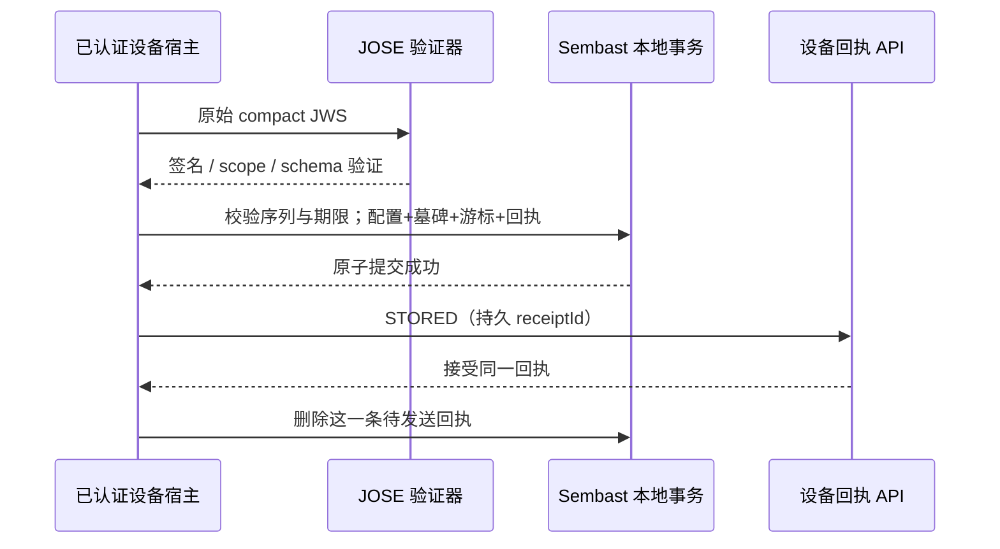

# 设备签名配置接收与恢复契约

更新：2026-10-09。对应 `packages/device_policy` 和后端 [delivery 契约](configuration-delivery-contract.md)。完整产品目标继续，本文记录设备接收组件的实际边界。

## 1. 交付与组件

| 组件 | 实际职责 |
|---|---|
| `DevicePolicyScope` | 预先注册的签名方、租户、设备、注册周期；四者共同形成存储命名空间 |
| `ConfigurationVerifier` | 可信公钥环、ES256、JOSE 类型、设备绑定、协议与首次期限校验 |
| `ConfigurationJournal` | Sembast 事务保存配置、删除墓碑、高水位及回执；恢复时重新验签 |
| `StoredConfigurationReceipt` | 保存后才产生 STORED；相同消息重试保留 receiptId |
| `tool/verify-nimbus.ps1` | 从已验证后端 JAR 使用真实记录、ConfigurationSigner 与 Nimbus 生成公共互操作夹具 |

JOSE 解析、签名验证及公钥运算使用 [jose SDK](https://pub.dev/packages/jose/versions/0.3.5%2B2)；事务、文件写入和恢复使用 [Sembast](https://pub.dev/packages/sembast)。未自行实现密码算法、文件日志或数据库。实际锁定版本 jose 0.3.5+2、sembast 3.7.2，适配当前 Dart 3.4；两者 BSD-3-Clause。依赖完整供应链扫描与商用分发声明仍纳入发布流程。

## 2. 信任与验签

1. 宿主通过获准的注册与可信 TLS 链路提供 scope 和验证环；不从待验证消息推导当前设备或签名方。
2. 验证环为 1～32 个不同 kid 的 EC/P-256 公钥；禁止私有 `d`、错误算法/用途和非 VERIFY 操作。同 kid 不允许歧义。
3. 只接受紧凑 JWS、ES256、`aimanager-configuration+jws`；头部只允许 alg/typ/kid。不读取嵌入 jwk、jku、x5u 等密钥或 URL，不接受未支持的关键扩展。
4. JOSE SDK 验签成功后，再检查 issuer、tenantId、deviceId、registrationId 精确一致。清理命令和额度租约使用不同类型，不能复用为配置。
5. 协议 schemaVersion=1、purpose=CONFIGURATION、mode=CONFIGURE_ONLY；UUID 为规范小写形式，游标/来源序列为 1～2^53−1 的整数，时间为安全整数毫秒。
6. 首次交付必须 issuedAt ≤ 当前可信时间 < deliveryExpiresAt，交付跨度不超过后端允许的 24 小时。未知 effectiveUntil 或 ENFORCE 拒绝，保留原已保存状态。
7. UPSERT 要求文档及四个列表字段；REMOVE 要求 document=null。任何非空 effectiveEffect 拒绝，文档只是已验证的配置输入，尚无原生执行含义。规则、应用和计划的原生语义验证由后续适配器完成。

输入 JWS 上限 1 MiB；返回模型深度不可变。错误只暴露稳定代码，不附带原始载荷、密码、视频、私钥或解析堆栈原因。

## 3. 事务与重放

- 配置、全注册高水位和待发送回执在同一事务保存，不能先推进游标。异步处理必须按服务端页面升序进入接收组件；相同消息可并发重试，SDK 事务串行化。
- 同来源序列只能是同不可变版本、动作、文档及游标；新的传输尝试可以更换 deliveryId/期限。相同 deliveryId 的不同签名内容拒绝。来源序列下降或新版本落在全局高水位之前拒绝。
- 重复已经保存的原始签名可在首次期限之后恢复原回执，不重新延长或生成配置；回执丢失或 ACK 丢失均可用原 ID 重发。
- REMOVE 只删除这一策略的活动配置，持久保留签名墓碑/来源序列，重开数据库后旧版本不能复活；它不撤销设备身份、不擦除数据、不解除系统管理。
- 回执上限默认 128、策略流（含墓碑）上限默认 64，支持宿主配置 1～1024。到达上限时事务失败、原配置和游标保留；先发送并确认积压回执。墓碑不自行清除，注册生命周期清理及安全同步压缩待宿主实现。
- 已关闭数据库、容量异常、损坏元数据等返回 STORAGE_FAILURE，不能反馈保存成功。回执只有 STORED，不发 APPLIED，也不修改设备系统能力。

## 4. 离线、时间与恢复

宿主提供可信时间函数；SDK 不默认信任 `DateTime.now()`。当前记录已观察的最高时间；新接收发生回拨时返回 CLOCK_UNTRUSTED 并保留原配置。这不等于硬件可信时钟，也不能阻止具有本地数据库改写权限的攻击者。在线可信时间锚、单调时钟、跨启动反回拨和安全存储属于 Android/TV 适配器验证。

重开数据库后重新检查每个签名与当前 scope/验证环，校验保存的回执、策略键与高水位，拒绝损坏记录。交付 TTL 不作为永久配置的到期时间；原来的配置继续可恢复。更换注册周期使用独立命名空间，不复用上一周期游标。密钥正常轮换保留旧 VERIFY 公钥覆盖离线配置；紧急撤销密钥后恢复会失败，宿主需引导可信恢复，不能静默导入未知密钥。

Sembast 文件数据库在内存加载内容，宿主必须设置资源预算与应用私有路径。本文没有宣称静态加密、硬件防回滚或浏览器 IndexedDB 持久能力。恢复错误不能被宿主解释为解除既有系统限制；异常应保持上次有效原生状态并进入可恢复诊断流程。

## 5. 对接约束与下一条链路

目前包接收原始签名，未实现设备 HTTP 认证/拉取循环、完整页面 nextAfter 提交、退避、MQTT 通知、拒绝回执发送或原生接口。宿主必须核对 HTTP 项 id/cursor/期限与签名中的字段；不得把未验证的服务器分页续点直接写入本地高水位。

库内 CLOCK_UNTRUSTED 是本地诊断代码，不是后端拒绝枚举；不得把所有本地异常直接序列化为 `reason`。收到无效签名时不能信任其中的 deliveryId。只有经过认证的传输元数据和规则允许时，才能发送对应拒绝回执；已 STORED 的同一次尝试不能后续发送矛盾拒绝。

后续继续完成儿童 Flutter 宿主、Android/Kotlin 安全存储、独立设备凭证、真机启动/重启对账、策略语义/执行与反馈，以及 TV 遥控器流程。受管权限仍由获准的原生/EMM 模式提供，Flutter 接收组件不能自行产生这些权限。

## 6. 当前验收证据

| 验证 | 实际结果与范围 |
|---|---|
| 验签与绑定 | 15 项 Dart VM 与 15 项真实 Chrome 测试通过；签名篡改、算法混淆、错误类型/密钥、跨设备、整数/模式/期限边界 |
| 持久接收 | 14 项实际 Sembast 文件数据库测试通过；关闭/重开、并发重放、墓碑、容量、时钟回拨、公钥撤销与损坏恢复 |
| 全包分析 | 29 项 VM 测试通过；dart analyze 无问题 |
| 跨语言 | 已验证后端 JAR 中的 ConfigurationEnvelope/Document/Signer + Nimbus → Dart JOSE 验证通过；中文载荷语义一致，临时私钥已删除 |

RED→GREEN：初始 14 项因验签功能缺失失败；存储阶段 14 项通过、11 项缺实现失败；首次实现暴露 Sembast 快照只读，修正可写副本后 25 项通过。审阅增加的交付 ID 不变性与容量上限均真实失败后修复，最终 27 项通过。互操作工具 Windows 编码问题已修正，不计失败记录为成功证据。

随后增加算法混淆与公钥撤销回归，最终全包 29 项、Chrome 15 项通过。部署构建脚本自动识别新增纯 Dart 库，执行其 pub get/analyze/test；可通过 `-DartCommand` 指定工具路径，默认使用 Flutter SDK 同目录的 Dart。

独立发布快照基于 `b37f6f3` 加设备组件代码，在 `.local/device-policy-build-check/` 完整构建：后端 157 项、管理台 7 项、设备操作组件 42 项、当时设备配置组件 27 项全部通过，分析及 Web release 成功。后续仅新增的两项回归由上述 29 项最终运行覆盖。该快照未混入并行的额度/访问窗口代码，也未另启服务，不代表整份并行工作区已验证。

日志：`.local/device-policy-{verifier-red,journal-red,journal-green,review-red,final-test,chrome}.log`。互操作公共证据在受限 `.local/device-policy-interop-*/fixture/`；无生产凭据。没有 Android/TV 真机、进程被杀、掉电文件耐久性、原生阻止应用或系统级防绕过成功证据。
