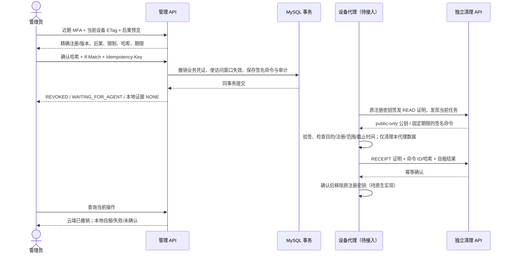
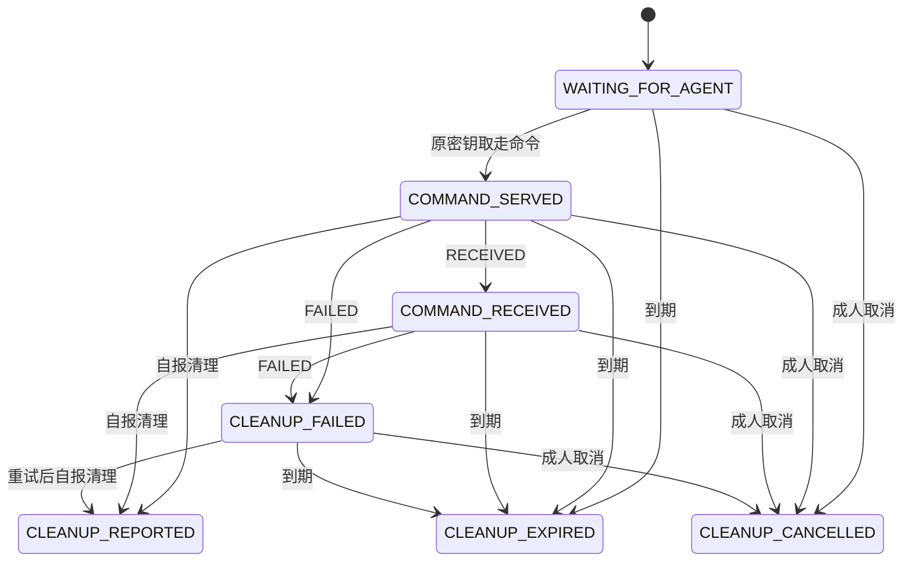

# 设备正常退出与清理契约

更新：2026-10-09。本文描述已有 `lifecycle` 后端实现；客户端页面、本地清理执行、EMM 解除和整机擦除尚未交付。完整功能仍按[实施计划](implementation-plan.md)推进，证据见[实施记录](implementation-progress.md)。

## 1. 能力与产品状态

当前只接受 `AGENT_UNENROLL`：管理员请求当前 BYOD 注册退出云端业务，并向原注册密钥持有者提供限时、签名的**本代理数据清理**任务。支持 ACTIVE 和已紧急撤销的 REVOKED 注册；尚未确认的注册应走注册取消流程。重新注册创建新设备/注册周期，不恢复旧凭证。

| 结果 | 已有证据 | 管理端应显示 |
|---|---|---|
| 云端业务访问撤销 | 设备状态、凭证域和凭证在事务内撤销 | 远程业务访问：已撤销 |
| 已有访问窗口失效 | 设备撤销领域事件在原事务内使审批失效 | 此设备的旧访问窗口已失效 |
| 清理任务已取走 | 原密钥认证的 GET，记录首次取走时间 | 清理命令：已提供；执行情况待回执 |
| 代理自报数据已清理 | 有效密钥证明、准确命令哈希及幂等回执 | 本地清理：设备自报，尚未经独立验证 |
| 到期未报告 | 固定截止时间与持久状态变更 | 本地清理：未确认，任务已到期 |
| EMM 解除 / 整机擦除 | 无正式适配器 | 当前不支持，不创建执行任务 |

`CLEANUP_REPORTED` 不是“经验证已退出系统管理”，不证明磁盘安全擦除、其他 App 数据删除或密钥物理删除。服务端没有 `DEPROVISIONED`/`WIPED` 成功状态。云端使用记录、审计、订阅和席位不会在本操作中删除或退还，后续由相应领域按授权处理。

退出恢复通道是基础安全流程，不能因未来套餐欠费而被隐藏。当前没有计费或权益拦截实现，也没有正式商业套餐能力交付。

## 2. 端到端流程



业务凭证失效可能是过期、紧急撤销或正常退出；**收到业务 401 不构成本地清理授权**。客户端只有在得到可验证、绑定自己的清理命令后才能执行清理。设备离线时不能声称撤销命令已送达；本地恢复、计时、断电与重启需要原生专项验收。

取消只停止服务端继续提供该任务或接受新回执，不恢复业务凭证，不撤销已执行清理，也不能召回设备离线时已经缓存的有效签名命令。确认页必须在提交前说明此后果。

## 3. 管理 API

统一前缀：`/api/v1/tenants/{tenantId}/devices/{deviceId}/deprovision`。用户使用 OIDC JWT；当前数据库成员关系是授权权威。

| 方法/后缀 | 请求 / 响应 | 要求 |
|---|---|---|
| POST `/previews` | `{action:"AGENT_UNENROLL"}` → 201 DeprovisionPreview | OWNER/GUARDIAN/ORG_ADMIN、近期 MFA、设备 If-Match |
| POST `/operations` | `{previewId,previewHash}` → 201 DeprovisionOperation | 同一确认人、预览未用/未过期、当前设备/注册/版本、近期 MFA、If-Match、必填 Idempotency-Key |
| GET `/operations` | limit/cursor → ItemPage | 成人或 AUDITOR；默认 50/最大 100，UUID 游标 |
| GET `/operations/{operationId}` | Operation + 强 ETag | 成人或 AUDITOR；租户和设备均匹配 |
| POST `/operations/{operationId}/cancel` | Operation + 强 ETag | 当前成人、近期 MFA、操作 If-Match、必填 Idempotency-Key |

儿童、教师和外租户成员不能调用这些接口；儿童既有设备列表会看到 REVOKED，不提供管理员身份或退出审批信息。AUDITOR 只读。

预览包含 id、deviceId、registrationId、deviceVersion、action、consequences、limitations、hash、expiresAt。哈希由服务端生成并持久化，绑定确认人、租户、注册、版本、期限和精确后果。设备心跳也可能改变设备版本；提示重新获取预览，不能自动替用户确认新后果。

操作包含 id、deviceId、registrationId、commandId、action、state、remoteAccess、localEvidence、reasonCode、issuedAt、notAfter、version。管理响应不包含清理签名文档或设备私钥。创建返回操作 ETag；该 ETag 与设备 ETag 属于不同资源。所有 JSON 时间为 UTC Unix **毫秒**。

同键同载荷返回原响应快照，包括原版本和原状态；客户端随后 GET 当前操作。撤销成员或失去成人权限后，原键也不能读取缓存响应。不同键再次消费同一预览失败；取消或到期后可重新预览并创建新的操作/命令，普通设备凭证仍不复活。已自报清理完成的操作不能取消或作为自动续期依据。

## 4. 原密钥清理认证

独立命名空间 `/api/v1/device-cleanup`，Spring Security 第 0 顺序链；普通用户 JWT、普通 opaque 设备凭证均不接受。清理证明也不能访问管理和常规设备 API。该命名空间没有注册、恢复业务凭证或修改策略入口。

| 方法/路径 | action | 用途 |
|---|---|---|
| GET `/signing-keys` | READ | 当前有效任务的 public-only ES256 验证公钥环 |
| GET `/command` | READ | 当前任务 operationId、commandId、notAfter、compactJws；首次读取记审计 |
| POST `/receipts` | RECEIPT | 当前操作绑定的结果回执 |

`Authorization: Bearer <原注册密钥签名的 JWT>`；最大 8192 字符。Nimbus 验签，公钥来自原注册记录，不采信证明里提供的公钥。注册必须 REVOKED，公钥指纹须与任务绑定指纹一致。

| 位置 | 必须值 |
|---|---|
| JOSE alg / typ / kid | ES256 / `aimanager-cleanup-auth+jwt` / 当前 registrationId |
| iss / sub / aud | `device:{registrationId}` / deviceId / 仅 `ai-manager:cleanup` |
| purpose / tenantId / registrationId | AGENT_CLEANUP / 当前租户 / 当前注册；标识为规范小写 UUID |
| action | READ 或 RECEIPT；读取与提交权限分开 |
| operationId | RECEIPT 必填；READ 可省略以发现当前任务，提供时须与当前任务一致 |
| iat / exp / jti | 必填；exp > iat、未过期、最长 300 秒；iat 最多超前 30 秒；jti 为规范 UUID |
| nbf | 如提供，最多超前 30 秒 |

拒绝内嵌/远程 JWK、X.509 URL/证书链和未支持的 critical header。P-256 公钥不得包含私钥；存在 alg/use/key_ops 元数据时，必须允许 ES256/SIGNATURE/VERIFY。预览与认证共用同一 SDK 校验函数，避免先撤销后发现密钥不兼容。

该证明是**短时可重用认证**，jti 不是一次性消费 nonce。必须走可信 TLS，不记录 Authorization，原密钥需由原生安全存储保护。截获证明可在其期限和限定命名空间内重放；回执 ID/哈希仅解决业务幂等，不能声称消除了凭证重放。原生密钥安全、证明刷新与时钟可信程度尚待实现。

公钥响应只含公开材料且 key_ops=VERIFY；客户端必须验证服务端 TLS 身份/正式信任配置，不能信任任意地址返回的自签 JWK。根信任轮换、离线验证缓存和证书策略另需客户端验收。

## 5. 签名命令和回执

命令使用 Nimbus ES256 JWS：typ=`aimanager-cleanup-command+jws`，kid=外置签名密钥 ID。与普通配置 JWS 类型分离。负载为：

```json
{
  "schemaVersion": 1,
  "purpose": "AGENT_CLEANUP",
  "tenantId": "<当前租户 UUID>",
  "deviceId": "<当前设备 UUID>",
  "registrationId": "<原注册 UUID>",
  "keyThumbprint": "<原公钥指纹>",
  "operationId": "<操作 UUID>",
  "commandId": "<命令 UUID>",
  "issuedAt": 1791514800000,
  "notAfter": 1791601200000,
  "scope": "OWN_AGENT_DATA_ONLY",
  "actions": ["CLEAR_POLICY_CACHE", "CLEAR_USAGE_CACHE", "CLEAR_BUSINESS_CREDENTIALS"],
  "keyRemoval": "AFTER_SERVER_ACK"
}
```

设备仅清理自身代理保存的策略缓存、使用缓存和业务凭证；保留提交本次回执所必需的窄范围材料直到收到确认，再清除原注册密钥。第三方 App、个人媒体、系统账户、工作资料和整机存储均不在范围内。服务器不能独立证明设备实际执行或密钥删除。

重复拉取同一持久 JWS，截止时间不延长；新任务使用新的 operationId/commandId。缺外置签名密钥时，正常退出确认返回 503，凭证不撤销；原有紧急 `/devices/{deviceId}/revoke` 仍可立即撤销访问，二者不混淆。

回执字段：receiptId、commandId、commandHash（compactJws UTF-8 的 SHA-256 小写十六进制）、stage、reasonCode。stage 为 RECEIVED / AGENT_DATA_CLEARED / FAILED；只有 FAILED 必须带 reasonCode（STORAGE_FAILURE、KEY_UNAVAILABLE、UNSUPPORTED_AGENT、USER_ACTION_REQUIRED），其他阶段不得带。设备身份/操作由认证上下文确定，正文不能改绑。

未取过命令不能确认；同 receiptId 同载荷返回原快照，异载荷 409。迟到 RECEIVED 不回退失败或已清理状态；FAILED 后可以重试并报告清理，已报告清理后的新 FAILED 被拒绝。到期、取消或被新任务替代后，不接受旧证明/回执，即使此前已提交过相同回执；设备与管理者需要保留“确认响应可能丢失”的不确定性。



所有操作 remoteAccess=REVOKED。未收到结果时 localEvidence=NONE；收到清理或失败报告时为 DEVICE_REPORT_UNVERIFIED。到期不清除历史报告，不转成执行成功。

## 6. 数据、配置和运维

V12 迁移：deprovision_previews、deprovision_operations、deprovision_heads、cleanup_receipts。租户复合键、设备/到期索引、命令唯一约束和回执外键；head 表串行化每个注册的当前任务，旧操作/回执保留用于审计。lifecycle 通过 Fleet 公开接口读取/撤销注册，不直接修改设备表。

管理员写入按成员 → 设备 → 预览/head → 操作；清理接口按 head → 操作，后台到期只锁操作，无逆向追加 Fleet 锁。幂等记录、源凭证撤销、审批失效、命令、预览消费与审计同事务。签名没有外部网络 I/O；真实 MySQL/OceanBase 锁等待、隔离、索引和死锁恢复仍需对应 profile 认证。

| 环境变量 | 默认 | 合法范围 / 语义 |
|---|---|---|
| DEVICE_EXIT_PREVIEW_LIFETIME_SECONDS | 300 | 30～900；预览确认期限 |
| DEVICE_CLEANUP_LIFETIME_SECONDS | 86400 | 300～604800；任务绝对期限，不靠拉取续期 |
| DEVICE_CLEANUP_EXPIRY_JOB_ENABLED | true | Spring 到期作业开关 |
| DEVICE_CLEANUP_EXPIRY_BATCH_SIZE | 100 | 1～1000；每轮上限 |
| DEVICE_CLEANUP_EXPIRY_INTERVAL_SECONDS | 30 | 5～3600；每轮间隔 |

复用 CONFIGURATION_SIGNING_KEY_FILE / CONFIGURATION_VERIFICATION_KEYS_FILE 外置密钥环，见[配置交付契约](configuration-delivery-contract.md)。非法期限/作业配置启动失败，不静默修正。

Spring Scheduler 通过数据库行锁、固定批次和状态条件持久到期；没有自研定时器。管理员详情/列表也会持久校验到期并增加版本。多副本可等待同一批次，数据库超时/失败交给作业后续轮次处理；这不构成百万设备吞吐认证。

审计记录预览、确认、云端凭证撤销、首次命令读取、每个新回执、取消和到期；复用请求关联 ID，不记录原私钥、证明、JWS 正文、儿童文本或 SQL 值。审计不可篡改归档、历史保留/删除和清理速率治理还未完成。

## 7. 页面、验证与发布门槛

待实现的设备详情页同时呈现“云端访问”和“本地清理”两张状态卡。退出按钮进入后果预览 → 近期 MFA → 明确确认；取消说明已缓存任务无法召回，不能写“恢复管理”。版本冲突重新预览；503 显示签名服务需修复，同时保留有权限的紧急撤销入口。儿童端显示联系监护人的恢复方式，不提供管理员操作。

已有测试使用 H2、MockMvc 和真实 Nimbus 签名/opaque 认证，覆盖成人/儿童、MFA、ETag/幂等、原密钥与用途、跨任务、固定期限、取消/新任务、乱序回执、全局有界到期、审批事务失效、无密钥配置和故意数据库失败后的整体回滚。

剩余发布门槛：Flutter 预览/确认/状态页面；Android/TV 原生清理及密钥删除；离线/重启/丢失确认恢复；真实数据库并发和保留治理；正式受管解除/独立擦除预览与供应商/设备证据。上述功能和证据未完成前，不将完整 END-01 或整个产品标记交付完成。
