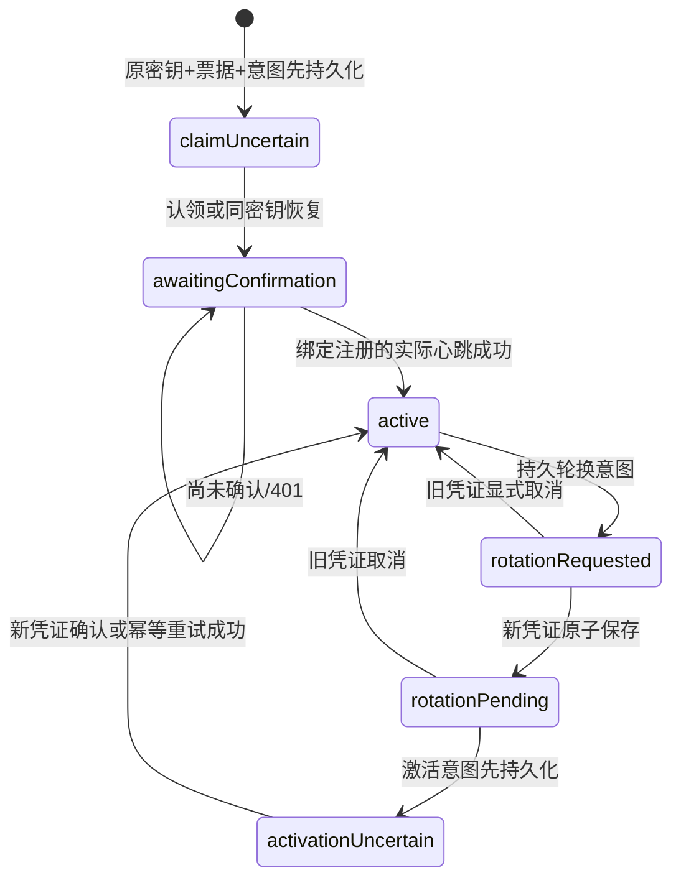

# 设备身份、认领恢复与凭证生命周期客户端契约

更新：2026-10-09。实现 `packages/device_identity`；后端对应[注册契约](device-registration-contract.md)。这是儿童宿主所需的协议组件，完整儿童产品、原生适配和系统管控继续实施。

## 1. 分层与信任来源

| 对象 | 职责 / 边界 |
|---|---|
| `DeviceIdentityManager` | 持久意图、阶段转换、序号与恢复；单记录单宿主，不自行重置身份 |
| `DeviceSecretStore` | 宿主平台 SDK 提供一个原子、持久、加密、应用私有记录；协议包没有明文生产适配器 |
| `DeviceEnrollmentKeys` | 可替换生成/签名提供者；句柄跨进程可恢复，后续原生提供者可保存 Keystore alias |
| `JoseDeviceEnrollmentKeys` | 当前软件 P-256/ES256 提供者；私有 JWK 句柄只进入上述 secret store，不代表硬件不可导出或设备证明 |
| `EnrollmentProof` | 公开 P-256 JWK、短期 JWT；拒绝私有字段、不支持头部、错误曲线/算法/用途、过大输入 |
| `DeviceIdentityApi` | http SDK、明确 HTTPS root、固定六种操作、独立 opaque 凭证、有界可取消请求，无自动重试 |
| `DeviceIdentityView` | UI 可读事实；无私钥/票据/bearer/配对码；单独暴露认证暂停与 pending 心跳 |

使用 [jose 0.3.5+2](https://pub.dev/packages/jose/versions/0.3.5%2B2)、[http 1.6.0](https://pub.dev/packages/http/versions/1.6.0)、[uuid](https://pub.dev/packages/uuid) 成熟 SDK；锁定解析 uuid 4.6.0。jose/http 为 BSD-3-Clause，uuid 为 MIT，已核对本地锁定包 LICENSE；完整漏洞/SBOM/再分发声明仍是发布门槛。JOSE 旧版本导出填充或最小宽度整数，组件使用 Dart 标准 base64url 编解码规范成固定 32 字节无填充坐标，不自己实现 ECDSA。

API 地址由宿主确认并绑定 secret record，不能由未验证二维码自动替换；跨 origin/路径读取已有记录直接拒绝，不隐式生成另一身份。父母票据提供租户、注册 ID、随机 token 与期限，票据持有不授予管理员身份。服务端仍以实际票据、签名、范围、授权者及主体事实决定认领。

宿主时间由调用方提供；组件记录已观察高水位并拒绝回拨，不等于可信硬件时钟。secret store 单记录原子替换是必需契约；多个 manager/进程操作同一记录需原生排他锁。当前组件内只防止同一个 manager 的并发写操作，冲突返回 IDENTITY_BUSY。

## 2. 状态机与管理员确认

认领前保存 keyHandle、原票据、地址/租户绑定、设备自报名称/系统版本。存储失败不发送请求。proof 只使用 `ai-manager:enrollment-claim` 或 `ai-manager:enrollment-recover`，sub/nonce 精确绑定票据，iat/exp 为秒、有效 60 秒，每次新规范 UUID jti。公开 JWK 不含 d，也不携带 sign 操作；私钥提供者异常统一脱敏。

认领响应严格检查设备/注册 UUID、43 字符 opaque、期限、八位配对码与 AWAITING_CONFIRMATION；只在原子保存成功后展示。响应丢失或保存失败保留 claimUncertain，重新创建宿主仍使用原密钥恢复，新 proof/jti 不复用旧证明。自动生成新密钥、重建身份、绕过恢复上限均不允许。若原请求根本未到达服务端，恢复可能返回 ENROLLMENT_UNAVAILABLE，宿主可以显式请求同票据 retryClaim，不进行无限自动探测。

监护人通过成人 API、近期 MFA 和物理设备配对码确认。只有设备实际成功提交绑定 registrationId 的心跳，客户端才记 active 并删除票据 secret/配对码；本地按钮不能确认。确认前 401 保留等待状态；超过 confirmBefore 也不能据此断言此前没有完成确认，合法 active 凭证仍可尝试权威心跳。

`active` 是云端身份的本地观察，不是应用已受控。当前 `systemEnforced` 固定 false，BYOD 模式不产生 DPC/防卸载/强制停止权限。

## 3. 心跳、失败与离线

- 心跳包含单调 sequence、agentVersion 和完整 capabilities；64 条以内、唯一规范 key、明确 bool/grantStatus，不能由自报支持提升系统能力。
- 发送前保存完整 pending 请求。网络/503/未知结果、错误 ACK 或保存 ACK 失败均保留原 sequence/body；重建宿主后原样重放。新快照不会覆盖未确认请求，返回 replayed 提示宿主随后再发送新快照。
- ACK 必须是同一 registrationId、安全整数 sequence、合法 receivedAt。严格拒绝非整数 JSON 数值；该服务时间仅记录观察事实，不擅自替代宿主可信时间。
- ACTIVE/轮换过程的 401/403 持久记录 cloudAuthenticationBlocked，activeCredential 不再向配置同步提供凭证。保留原密钥、身份和待处理请求，不把认证失败自行判定为永久撤销或执行本地擦除。
- 显式成功的认证操作清除暂停；错误 retryable 仅是传输诊断，宿主必须按当前阶段选择重放/恢复/取消，不能把所有写操作通用重试。
- 原设备凭证到期不返回有效业务凭证，时钟回拨拒绝访问。不能靠离线、重启、过期或重新注册偷偷延长临时通行/额度；这些文档仍由各自签名协议校验。

## 4. 两阶段轮换与崩溃恢复

| 失败点 | 已保存事实 | 恢复操作 |
|---|---|---|
| 认领前写失败 | 没有完成身份意图 | 不发送；修复安全存储后由宿主重试 |
| 认领响应丢失/写失败 | 原票据、原 keyHandle、claimUncertain | 同密钥恢复，服务端保持注册周期 |
| 心跳结果丢失 | 完整 pending sequence/body | 原请求重放，ACK 后才递增 |
| 轮换申请响应丢失/新凭证写失败 | 原 active + rotationRequested | 用原凭证显式取消，再重新申请 |
| 激活前意图写失败 | rotationPending、旧 active 仍可用 | 不发送激活；修复存储后处理 |
| 激活响应丢失/完成状态写失败 | 新 pending + activationUncertain | 用新凭证幂等确认，不回退旧凭证 |
| 未发送激活已经过期 | rotationPending | 原凭证显式取消，不能延长期限 |
| 已发送激活跨过 activateBefore | activationUncertain | 新凭证尚未到期时仍可查询式重试；服务端可能已经激活 |

轮换响应只保存四个明确字段，丢弃服务器任意额外文案，减少敏感状态扩张与未来损坏风险。每次写失败均保留之前完整记录；SDK 不提供儿童重置/删除身份接口。正常解绑/删除、重新认领、安全恢复需结合已有管理员退出契约和后续原生宿主实现。

## 5. 传输与宿主对接

固定操作为 enrollment-claims、enrollment-claims/recover、device-api/heartbeats、credentials/rotate、credentials/activate 和 credentials/rotation/cancel。前两者仅票据+密钥证明，后四者仅独立 opaque；用户 JWT 不可替代。所有路由以配置 root `/api/v1` 为前缀，禁止自动重定向、URL 用户信息/query/fragment 和含混路径。

默认期限 20 秒，范围大于 0 且不超过 2 分钟；响应默认 64 KiB，可配置 1 KiB～1 MiB。成功状态必须符合该操作契约，JSON object/content type 正确；激活/取消只接受空 204。超时或关闭中的 POST 明确报告 outcomeUnknown。注入的 http client 由宿主管理，默认 client 随 adapter 关闭。

后续儿童宿主将 `identity.activeCredential` 传给 `DeviceConfigurationTransport`，由预先绑定的 tenant/device/registration、可信 issuer/公钥环/时间构建配置 verifier。两者不互相赋予管理员权能；配置/审批/额度文档的事务及执行仍分域处理。

Android 安全存储拟用平台成熟 SDK；例如 [flutter_secure_storage](https://pub.dev/packages/flutter_secure_storage) 的版本/Android 最低要求、备份和迁移需要按现有 Flutter SDK 解析与真机认证。当前没有安装该插件、没有生产 encrypted-store 实现，也没有宣称软件 JWK 不可导出。Web 的浏览器存储不能冒充 Android Keystore。

## 6. 当前验收证据与剩余范围

| 验证 | 实际证据 |
|---|---|
| 本地组件 | 37 项 VM 测试通过，analyze 无问题；真实 Dart HttpServer/JOSE，明确内存 secret-store 替身/故障注入 |
| 浏览器 | 最终身份证明/公开模型 5 项真实 Chrome 通过；既有配置验签 15 项同时复核通过 |
| 跨进程协议 | DeviceIdentityHttpInteropTest 实际通过：随机回环 Spring、真实认领/恢复/Nimbus proof、确认前 401、配对确认、heartbeat、两阶段轮换、激活 ACK 后存储失败及新凭证幂等重试、旧凭证 401、撤销后 401 |
| 场景真实性 | 成人 JWT/近期 MFA 为明确夹具；设备注册和凭证没有 SQL bootstrap，设备使用实际 HTTP 和持久测试状态，安全存储加密/硬件不在该结果内 |

联调位于受限独立 `.local/device-identity-backend-source/`，测试临时 plaintext secret record 只为跨进程故障证明，JUnit 退出删除 fixture/token/private-key state，保留四份 PASS 诊断。MockMvc 自动请求/响应打印关闭，设备 SDK/失败断言不打印秘密记录。此夹具不可被应用作为生产存储导入。

RED→GREEN 已记录：缺少组件、SDK 导出 JWK 形状、严格心跳整数、轮换额外字段保留、原生提供者错误脱敏和公开证明模型私有字段。C 盘空间不足曾导致测试编译失败，改用独立 D 盘 TEMP/TMP 后继续；没有清理其他任务的文件，也不把环境错误计为测试通过。

最终独立发布复核位于 `.local/device-identity-build-check/`，基线 `e4e9edb` 加本阶段身份组件、跨进程用例和配置测试稳定性修复。后端 XML 汇总 159 项、0 失败/错误/跳过；管理台 7 项、设备操作 42 项、设备配置 58 项、设备身份 37 项全部通过，analyze 与 Web release 成功。另有部署保护 7 项、脚本解析 0 错误；自动测试合计 310 项，20 项 Chrome 检查另列。未混入并行任务的额度/审批/管理台修改，未启动或替换现有服务。

首轮发布复核出现的是正常配置测试的 500ms 期限在并行负载下误超时。修复后正常 HTTP 测试使用 10 秒，丢失 ACK 通过完整接收请求后真实断开 socket 验证，专门的传输超时用例保留；产品默认 20 秒未修改。最终完整快照重新执行通过，首次失败不计为成功证据。

构建脚本在身份组件及联调用例存在时自动解析依赖并传入 `device.identity.package`，确保真实注册联调运行；只运行 backend Maven 且没有该参数时该用例明确跳过，不得将其算作身份联调成功。发布清单包含源摘要与 JAR/Web 摘要，提交前核对本阶段可执行源与已验证快照一致。

仍待儿童 Flutter 页面、平台安全存储插件/非导出密钥、OS 作业/可信时间/重启、EMM/系统执行、TV 遥控与真机、真实 OIDC/MFA 及 MySQL/OceanBase 注册并发认证。完整功能目标继续，本阶段不能宣称设备端产品已经完整上线。
