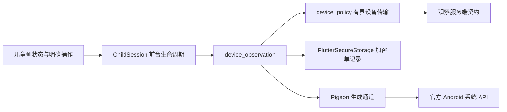

# 设备观察客户端阶段契约

2026-10-09，基线 `9ee446f`。本阶段交付 Android 原生观察、加密重试协议和儿童侧界面。完整产品目标继续实施，不以观察数据代替系统执行能力。

## 1. 当前可交付与服务端依赖

| 部分 | 本阶段状态 |
|---|---|
| 观察 SDK | 授权版本、固定路由、先持久后发送、原请求重试、严格回执、撤回清理 |
| Android | 官方 PackageManager / UsageStatsManager / AppOpsManager + Pigeon 21.2.0 |
| 儿童界面 | 授权说明、系统许可、最近确认、待发、失败、设置确认、手机/宽屏适配 |
| 成人观察管理页 | 尚未接入；儿童端不能修改云端授权 |
| 后端观察 API / V20 | 代码仍在工作区，已完成独立后端验证，尚未随本阶段提交；等待协作阶段 V13～V19 完整提交后合入 |
| 端到端真实 HTTP / MySQL | 本阶段尚未验证，不能宣称已打通生产服务 |

客户端与服务端契约见 [后端观察契约](device-observation-contract.md)。只有部署支持该契约的服务端、成人已经授权且设备系统许可满足时才能正常采集。服务端接口缺失/返回错误时停止新采集，界面显示未完成，不回退到无授权上报。

## 2. 分层与成熟组件



- Pigeon 源在 `apps/child/pigeons/observation_api.dart`，生成 Dart/Kotlin 同时入库。重新生成：在儿童端执行 `dart run pigeon --input pigeons/observation_api.dart`，然后 `dart format lib/platform/generated/observation.g.dart`。不手工修改生成文件；官方 formatter 清理生成器遗留的 switch 标签尾随空格。
- Pigeon 固定 21.2.0，适配当前 Dart 3.4.3；本次下载包 SHA-256 为 `f938cbea2249d68843f96953da7c787a99960578066492ac5962da1da8cabf67`。依赖许可证和传递漏洞扫描仍是发布门槛。
- 观察载荷不写入明文 Sembast。复用 `flutter_secure_storage 10.0.0` 固定配置，独立 `observation_record` 键，与身份记录分开；读取/写入都等待既有原生提交屏障。SDK 错误不自动清空、无浏览器存储替代。
- 单记录上限为 UTF-8 1 MiB；包含授权、序号、最多两份待发载荷、最近回执元数据，不包含成人令牌、设备私钥或摄像头内容。成功回执后移除对应原始待发载荷。

## 3. 实际流程与权限边界

1. 儿童端确认现有设备凭据可用；首次进入、心跳后和恢复前台只核对授权/系统许可，不自动读取清单或使用摘要。
2. 明确点击“同步已授权数据”才进入采集。先取得当前云端授权，持久化成功后再查询。清单授权和摘要授权互相独立，默认均关闭。
3. 使用摘要还要求系统特殊访问和解锁状态；打开系统设置前显示用途说明和确认，由系统决定最终许可。没有自动授予权限。
4. 原生仅查询当前用户可见 MAIN/LAUNCHER、MAIN/LEANBACK 应用，去重、排序、最大 500 条；不申请 QUERY_ALL_PACKAGES，不跨资料读取。签名摘要为自报观察，不证明应用安全。
5. 使用摘要查询最近一小时的系统日聚合；保留系统实际 first/last 时间，不把超出查询范围的日聚合裁成精确小时。仅匹配可见启动应用，不读取 `queryEvents` 原始操作事件。
6. 请求先保存后上传；未知结果保留原请求。联网重试先核对授权版本，不能把旧授权周期载荷发送到新周期。401/403、授权变更会清理待发载荷；不自动回退序号或重新注册。
7. 进入后台暂停进行中的后续保存/上传步骤；已发出的 HTTP 请求不能承诺被系统撤销，服务端仍须对每次写入检查当前授权。返回前台重新核对。
8. 系统撤权在下一次前台核对时清除本地使用 pending；云端撤回的本地清理发生在下次在线确认。不能承诺应用被停止时立即观察权限变化。

原生异步任务使用有界单工作线程和主线程回调；错误仅返回固定代码，不携带系统异常、应用清单或凭据。API30 才使用公开无参数 `isManagedProfile()`；更早系统不能可靠区分时标记 UNKNOWN。电视特征检测只是兼容线索，不是厂商/设备认证。

## 4. 本次实际验收

| 检查 | 实际结果 |
|---|---|
| `device_observation` analyze / test | 无问题；14 项通过，覆盖默认关闭、落盘前置、结果未知重放、ACK、撤回、离线、回滚、过期、暂停、并发和损坏记录 |
| `device_policy` analyze / test | 无问题；60 项通过，包含新固定观察路由与错误脱敏检查 |
| 儿童端 analyze / test | 无问题；22 项通过，包含组件四状态、小屏大字体、加密键/屏障及真实 ChildSession → ObservationAgent 接入 |
| Android 初始未授予 | 自有 API34 模拟器，19 个可见启动应用，使用查询返回固定拒绝错误；驱动退出 0 |
| Android 授予 | 同一自有模拟器，19 个可见启动应用、2 条实际系统聚合；驱动退出 0 |
| Android 撤回 | 同一测试应用撤回 GET_USAGE_STATS 后，19 个可见应用、使用查询拒绝；驱动退出 0 |
| 普通产品 APK | `lib/main.dart` debug 构建退出 0，26.8 秒；集成测试入口随后被普通 APK 覆盖安装 |
| 公开 Web 组件构建 | release/html、39.5 秒，退出 0；仅固定演示状态，不连接任何设备/后端 |
| Chrome 实际交互 | 390×844、1280×900；确认/取消、授权/离线/撤回状态、键盘焦点、无横向溢出和页面错误 |

上述 Android 结果不是实体手机/电视认证；SDK 存储键/屏障测试使用 mocked MethodChannel，观察 pending 的真实进程中断恢复尚未专项验证。先前身份存储真实进程恢复结果见 [儿童宿主契约](child-host-contract.md)，不能直接当作本轮观察载荷恢复证据。

浏览器首次执行未找到项目本地 Playwright，复用宿主预装 1.62.1；项目可重复安装仍由 `scripts/tests/package-lock.json` 固定。一次检查在动画结束前立即断言而失败，改用 Playwright 等待断言后全流程通过，没有修改生产状态绕过检查。继续沿用已有设计系统；此前 IAB 内核失败后的本机 Chrome 备用方式保持不变，未重新向第三方托管设计服务发送产品内容。

公开验收资料：[手机截图](design/observation/browser-mobile.png)、[宽屏截图](design/observation/browser-desktop.png)、[结果 JSON](design/observation/browser-qa.json)。截图是视口内状态，页面下方内容可滚动。

复现：在儿童端构建 `flutter build web --release --web-renderer html --no-web-resources-cdn --pwa-strategy=none --target tool/observation_preview.dart`，用回环 HTTP 提供 `build/web`，然后在 `scripts/tests` 执行 `node observation-ui-journey.cjs`。默认端口 8176，可用 `OBSERVATION_PREVIEW_URL` 指定回环地址。

原生检查仅在自有空白测试安装执行：

```text
flutter drive --driver=test_driver/identity_storage_driver.dart --target=integration_test/observation_native_test.dart --keep-app-running --dart-define=EXPECT_USAGE_ALLOWED=false -d <owned-emulator>
# 仅在该测试应用上授予系统使用访问，再以 EXPECT_USAGE_ALLOWED=true 运行。
# 撤回该许可后再次以 false 运行；最后重建并安装普通 lib/main.dart 入口。
```

## 5. 发布门槛与后续

仍待：后端有序提交与真实 MySQL 互操作、成人授权管理页、观察 pending 真实进程恢复、升级迁移与低内存/实体 TV、可信计时和额度执行、受管 EMM 接入、启动恢复、内容过滤、识别授权、商业订阅及性能安全验收。当前没有 DPC、应用阻止、防卸载、开机恢复、摄像头采集或后台周期观察，不能宣称完整平台全部可用。

## 官方依据

- [UsageStatsManager](https://developer.android.com/reference/android/app/usage/UsageStatsManager)：特殊访问、聚合实际时间和锁定限制。
- [UserManager](https://developer.android.com/reference/android/os/UserManager)：资料与用户状态的公开 API 级别。
- [AppOpsManager](https://developer.android.com/reference/android/app/AppOpsManager)：系统特殊访问状态。
- [包可见性声明](https://developer.android.com/training/package-visibility/declaring)、[Pigeon 21.2.0](https://pub.dev/packages/pigeon/versions/21.2.0)。
