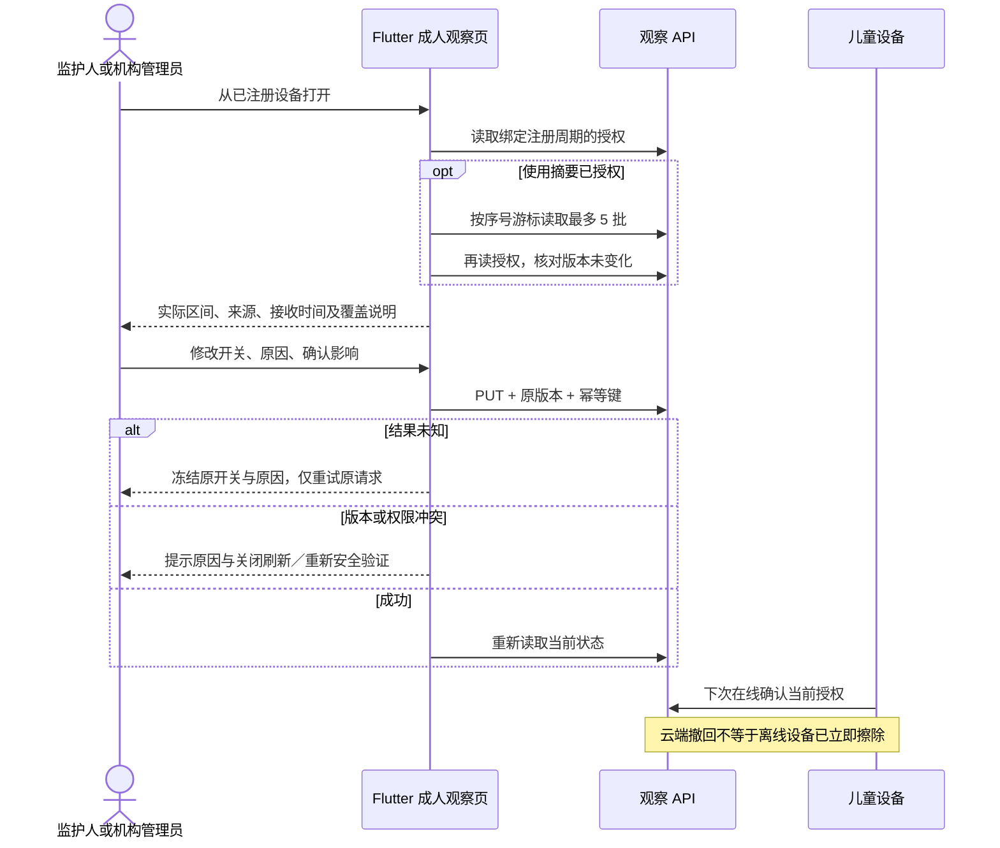

# 设备观察：成人工作流与 HTTP 互操作交付

2026-10-09；承接 [观察后端契约](device-observation-contract.md)、[Android 与儿童端阶段](device-observation-client-contract.md) 和 [实施计划](device-observation-implementation-plan.md)。本阶段交付成人观察模块、可复用模型、公开界面夹具及跨语言验证工具。完整平台目标继续推进。

## 1. 功能与接入边界

- 成人入口函数为 `openDeviceObservation(context, session, device)`；设备详情链接由协作任务维护 `console_pages.dart`。独立模块提交不代表该链接或待提交后端已经发布。
- OWNER、GUARDIAN、ORG_ADMIN 可以打开观察页；修改还要求设备 ACTIVE。教师、审计员、儿童没有成人观察页入口。服务端成员关系和设备范围是最终授权依据，隐藏按钮不是安全边界。
- 两个独立授权开关分别控制应用清单、系统使用摘要。变更必须填写原因、确认采集范围与撤回影响；服务器要求近期 MFA、强版本和幂等键。
- 本页展示授权状态及使用摘要批次；不重复实现已有应用目录页面。摘要仅为设备自报的系统聚合，不能证明已执行应用控制、不能作为精确今日总量、额度扣账或应用安全认证。
- 无授权、无报告、加载、响应不一致、工作空间变化分别展示。404 提示接口或设备不可用，不把所有 404 断言为服务未部署。

## 2. 读取与编辑流程



### 数据一致性

`ObservationRepository` 捕获 tenant/device/registration；请求前后都检查工作空间和角色。解析严格验证字段集合、UUID、整数精度、时间范围、资料类型、来源标志、降序游标、批次与应用上限。无法验证的响应整页隐藏，不展示部分成功数据。

读取摘要前后核对授权版本；任何变化隐藏此次读取。退出页或新读取通过 generation 丢弃迟到结果。修改前立即隐藏旧摘要；成功或关闭已尝试的编辑器后重新加载。仍无法追回此前已送达浏览器的数据，也不承诺瞬间检测另一管理员在页面空闲时做出的撤回。

### 写入恢复

每次打开编辑器固定一个幂等键和原版本。网络未知、5xx、不可解析回执保留原正文，冻结字段；点击重试仍使用原键、原版本、原正文。401/403/404/409/412/428 不自动覆盖，要求管理员处理身份或刷新。服务端近期认证检查仍会执行，重新验证按钮不能绕过它。

错误是 live region，提交失败后自动滚动到原因与恢复动作；原因字段明确 `enabled=false` 和 `readOnly=true`。当前 Flutter 3.22 Web 引擎未完整映射只读语义，因此锁定后排除文本域语义，以父级静态标签提供原原因和“已锁定”说明，同时保留 Form 状态。提交中禁止返回；关闭后检查当前服务器状态，不能把旧幂等响应当成实时授权。

## 3. 界面与无障碍

- 复用既有 Flutter Material 管理台主题、Panel、Notice、PageHeading；手机单列，宽屏保留可读宽度。对话框内部滚动，关闭和提交动作保持可见。
- 每页最多 5 批，逐批展开；每批最多 500 条应用通过有界列表滚动展示，不一次加载所有历史。
- 同时展示请求区间与系统实际 first/last 区间；时间统一为 UTC，并保留设备 IANA 时区。跨批次可能重叠，不相加、不绘制误导性的全天总量。
- 每条应用有合并的无障碍标签，包含名称、包名、前台时长和实际区间。包名可选择复制，所有设备名称和应用文字作为文本渲染。
- 明示保留天数和批次数均会裁剪历史；当前界面不宣称完整长期趋势。

## 4. 真实 HTTP 互操作

`DeviceObservationHttpInteropTest` 在回环随机端口启动实际 Spring Boot HTTP，调用生产 Dart `Api`、`ObservationRepository`、`ObservationAgent` 和设备传输，使用 Flyway 与事务检查数据库。覆盖：

1. 默认关闭，不读取系统源。
2. 成人显式授权后设备上传。
3. 服务端已提交、客户端故意丢失回执；独立 Dart 进程重放同一 pending，报告不重复入库。
4. 成人查看报告并撤回；授权、清单、报告及回执清理按各表契约核对。
5. 重新授权后，旧周期 pending 不得复活；新报告使用新授权版本和新 ID。
6. 撤销设备凭据返回 401，客户端清除本地授权和 pending。

测试中的成人 JWT decoder、系统源和活动注册均为显式夹具；跨进程存储是测试专用明文文件。它们不能证明真实 OIDC 登录/MFA、人脸识别、Android 加密存储进程恢复或设备原生系统执行。测试仅接受回环地址和独立 `observation_http_<32位hex>` MySQL 库；夹具凭据与待发文件结束后删除，输出只含固定 PASS/FAIL，不记录令牌和原始载荷。

### 已执行结果

| 检查 | 结果与范围 |
| --- | --- |
| 观察 SDK analyze/test | 无问题，14 项通过；包括本次新增 HTTP 工具 |
| 成人管理台 analyze/完整组件回归 | 无问题，57 项通过；包含并行工作区页面，不等于独立提交只包含这些页面 |
| 原因只读标志回归 | 先失败，再补显式 readOnly；编辑器 7 项重新通过 |
| 独立成人模块 | 已提交基线 65b02bd 加最终自有文件，19 项通过；不依赖协作未提交页面 |
| 公开 Web 构建与 Chrome | 最终 release/html 构建 32.9 秒退出 0；390×844、1280×900 全流程通过，无页面异常或横向溢出 |
| H2 实际 HTTP | 1 项通过，0 跳过；测试 32.66 秒，Maven 42.458 秒退出 0 |
| MySQL 实际 HTTP | 1 项通过，0 跳过；测试 55.62 秒，Maven 58.878 秒退出 0 |
| 后端源码对应关系 | HTTP 快照为基线 65b02bd 加自有 13 文件；生产文件一致，后来两份旅程测试增加数据库环境配置，旧结果不冒充更新测试结果 |

上述 HTTP 快照只含 **V1～V12 和 V20，共 13 个迁移**，用于新建隔离测试库。它不是有序 V1～V20 生产候选。V20 发布必须等待协作任务完整 V13～V19 提交，再对候选提交验证全部迁移链。

MySQL 验证由 Flyway 识别为 8.4；运行中出现“当前 Flyway 最新已测试版本为 MySQL 8.1”的兼容性提示。该 HTTP 流程成功不能消除版本认证门槛；依赖治理应在发布候选中处理并重验，尚无 OceanBase 或故障切换认证。

首次自有 Docker listing 超时且没有创建测试库；仅停止核实属于本次 helper 的挂起进程，保留协作服务。随后使用带连接、读取和查询超时的 JDBC 在现有本地 MySQL 创建独立库完成验证，没有改动业务库。

公开截图已经人工查看：[手机](design/observation-guardian/browser-mobile.png)、[桌面](design/observation-guardian/browser-desktop.png)、[手机展开摘要](design/observation-guardian/browser-mobile-expanded.png)、[手机失败重试](design/observation-guardian/browser-mobile-retry.png)。它们仅是滚动页面的视口；展开区间和错误恢复均实际操作验证。证据见 [浏览器结果](design/observation-guardian/browser-qa.json) 与 [源文件验证清单](design/observation-guardian/verification.json)。

### 复现

在后端有序源码与迁移齐全后，从 `backend` 执行（替换本机路径）：

```text
mvn -Ddevice.dart.command=<dart可执行文件> -Dobservation.device.package=<绝对路径/packages/device_observation> -Dobservation.guardian.package=<绝对路径/apps/guardian> -Dtest=DeviceObservationHttpInteropTest test
```

默认使用 H2。真实 MySQL 需预先创建空白独立测试库，再通过进程环境设置 `OBSERVATION_TEST_DATABASE_URL/USERNAME/PASSWORD`；不要在 CLI 参数或提交文件中写密码，不要指向生产库。普通完整测试默认跳过 opt-in HTTP 检查，跳过不等于通过。

公开 UI 夹具：在管理台构建 `flutter build web --release --web-renderer html --no-web-resources-cdn --pwa-strategy=none --target tool/observation_preview.dart`；回环 HTTP 提供 `build/web`，然后执行 `node scripts/tests/guardian-observation-ui-journey.cjs`，默认 8177，可用 `GUARDIAN_OBSERVATION_PREVIEW_URL` 指定回环根地址。夹具无账号、无设备或后台连接；不是登录后生产环境验收。

## 5. 仍待完成

有序后端提交与候选验证、真实管理员运行服务验收、观察加密 pending 真实进程恢复、实体 Android/TV 认证、EMM 系统执行、可信计时、内容过滤、启动恢复、商业计费、全量安全及容量认证均须独立完成。当前不能宣称防卸载、防强制停止或完整平台全部稳定可用。

## 后续增量：原生加密存储恢复

实际 Android 加密 pending 已以最终源码完成负对照、四次独立进程、原快照逐字重放、ACK 清理重开与合成键清理。详见 [原生持久化验收](device-observation-native-persistence.md)。该增量补齐上文历史阶段的存储验证缺口；独立 HTTP 夹具与独立原生存储结果不能相加称作完整生产端到端认证。实体 TV、正式受管执行、启动恢复与容量门槛仍保留。
