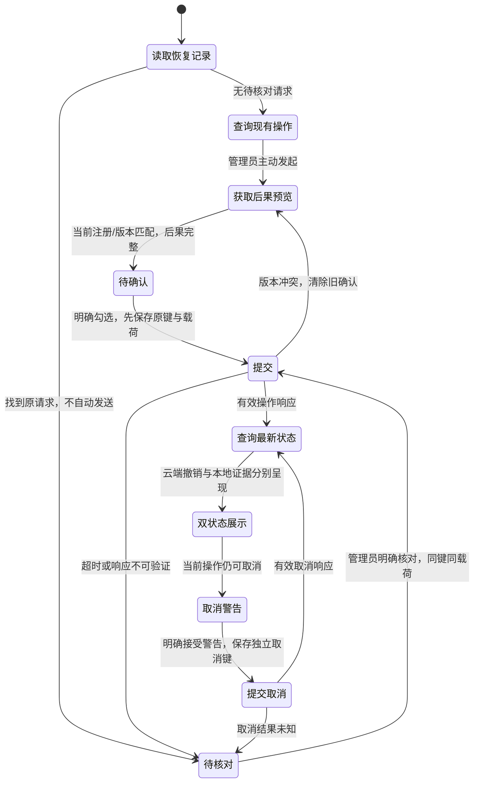
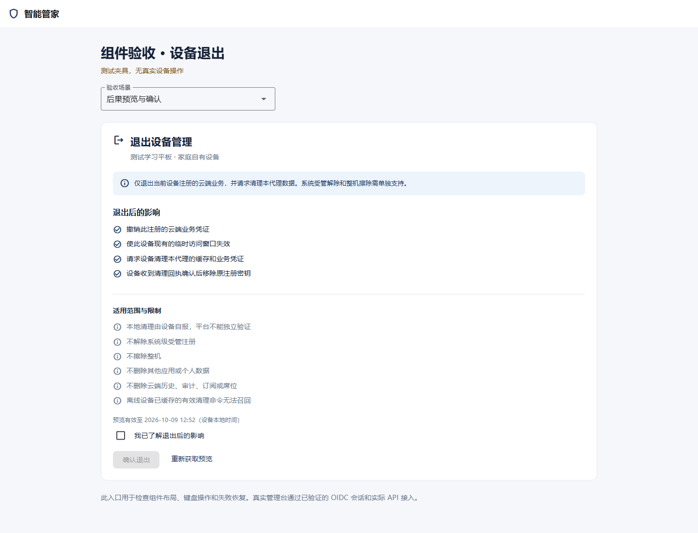
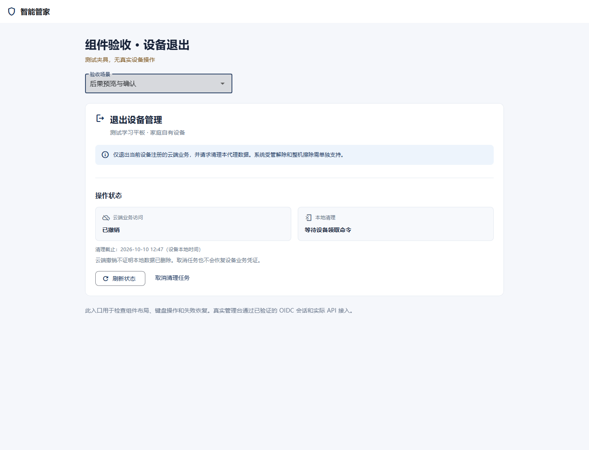
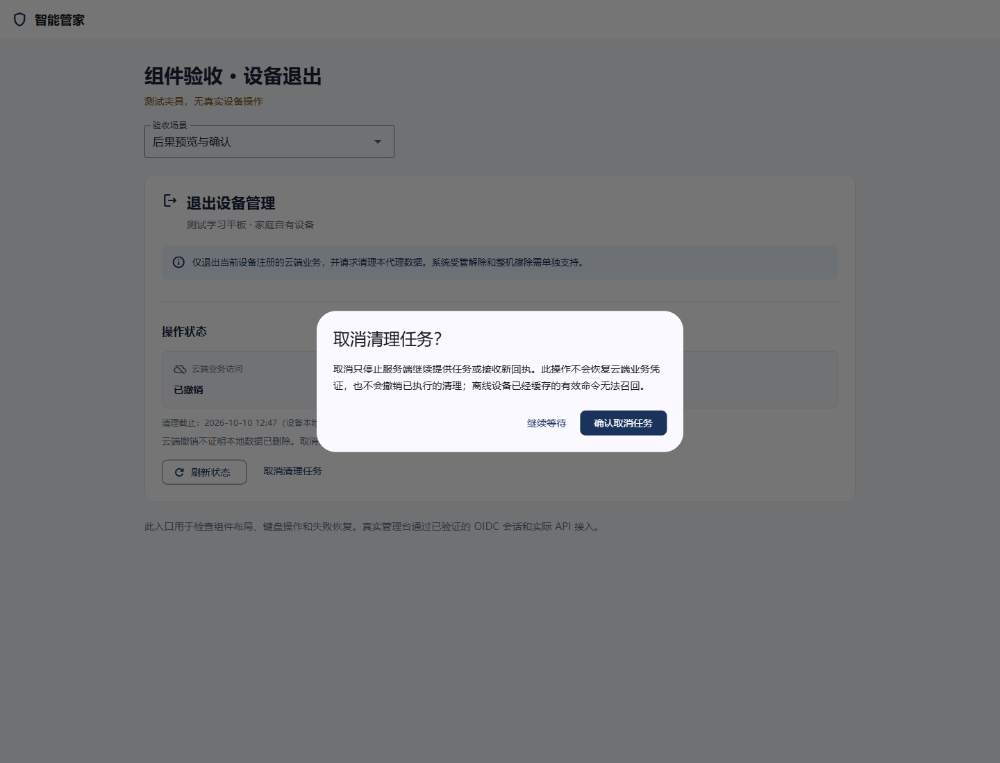
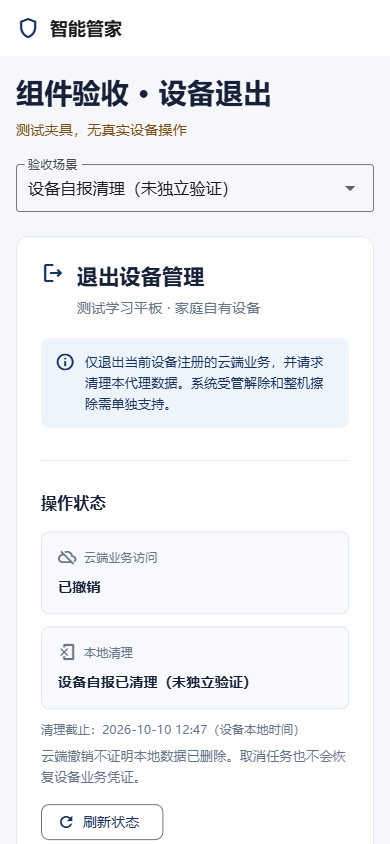

# 设备退出组件与管理台接入契约

更新：2026-10-09。独立开发范围为 `packages/device_operations`，管理台及运行服务由任务“给我前后端全部跑起来”负责。本文随组件实现更新；原生代理清理、受管解除及整机擦除另需交付。

## 设计与信息结构

复用[管理台视觉参考](design/management-console.png)：浅灰背景 `#F5F7FB`、白色面板、海军蓝 `#19335C` 主操作、正文 `#172238`、辅助文字 `#67758A`、边线 `#E2E8F0`；面板圆角 12、间距 8/16/24，按钮最小高度 44。标准 Flutter Material 3 控件承担焦点、键盘、语义和触控行为。

设备详情中的退出面板依次展示：设备与管理模式 → 明确后果 → 确认勾选 → 操作提交 → 云端访问与本地清理双状态 → 有边界的取消。窄屏纵向排布，正文自然换行，外层由可滚动页面或对话框承载。

| 状态 | 文案与操作 |
|---|---|
| 尚未预览 | 查看退出后果 |
| 预览有效 | 逐项展示后果与限制；勾选“我已了解退出后的影响”才启用“确认退出” |
| 预览过期或版本变化 | 重新获取预览并再次确认 |
| 提交网络失败/响应无法验证 | 提交结果待确认；保留原请求键，用“核对上次提交”重放原请求 |
| 已创建操作 | 云端访问：已撤销；本地清理独立展示 |
| 设备报告清理 | 设备自报已清理（未独立验证） |
| 取消 | 说明不恢复云端凭证，无法召回离线缓存命令 |

未知后果、缺失限制、未知状态与跨设备响应禁用破坏性操作，不能把未知字段翻译成成功。角色范围来自已验证的管理端会话，服务器仍为授权权威。组件不收集或保存用户密码、令牌、设备私钥。

## 实施验证

先编写模型、HTTP 契约、状态机及组件测试并观察失败，再实现。已运行 42 项独立组件测试与 1 项示例测试；覆盖响应绑定、实际 `errorCode`、有界分页、版本头、请求键复用、持久化失败、角色约束、预览过期、取消边界、窄屏及字体放大。包和示例静态分析、Web release 构建另有交付记录。上述数量不并入后端测试数。

## 管理台接入

管理台使用本地路径依赖，无第二套登录与网络框架：

```yaml
# apps/guardian/pubspec.yaml，由管理台任务负责接入
dependencies:
  device_operations:
    path: ../../packages/device_operations
```

```dart
import 'package:device_operations/device_operations.dart';

// session 来自现有已验证的 /me 与 /membership。
// device 是真实设备详情响应，禁止从 URL 或角色下拉框构造成人身份。
final controller = ExitController(
  scope: ExitScope(
    actorId: session.profile!['subject'] as String,
    tenantId: session.tenant!['id'] as String,
    deviceId: device['id'] as String,
    registrationId: device['registrationId'] as String,
    role: session.role,
  ),
  gateway: DeviceOperationsClient(
    apiRoot: Uri.parse(apiRoot), // 正式环境为受信任 HTTPS /api/v1
    clientFactory: session.authenticatedClient,
    allowLoopbackHttp: localDevelopment, // 仅 localhost/127.0.0.1/::1 可用
  ),
  journal: PreferencesExitJournal(),
);
await controller.initialize();

// 放入 SingleChildScrollView 页面或可滚动、受宽度约束的对话框。
DeviceExitPanel(
  controller: controller,
  deviceName: device['displayName'] as String,
  reauthenticate: () async { session.login(stepUp: true); },
);
// 宿主页面 dispose、退出登录、切换租户、注册或角色时：controller.dispose()。
```

重新验证回调只进入验证流程；返回或浏览器重载后，仍需用户明确点击“核对上次提交”。禁止回调自动调用 confirm/cancel。actor 的命名空间必须包含身份服务上下文；当前单一 issuer 的 subject 可直接使用，多 issuer 应使用经验证的 issuer + subject。

本包不接管客户端的关闭、刷新令牌或 OIDC 状态。宿主负责失去当前成员关系后销毁旧控制器。服务器对每次请求和幂等重放重新授权，因此本地角色只改善交互，不能提供安全授权。

## 恢复与实现边界

- `http` 处理网络，`uuid` 生成请求键，`crypto` 仅生成恢复命名空间摘要，`shared_preferences` 保存非秘密恢复元数据。解析严格校验 UUID、毫秒时间、整数版本、预览哈希、设备与注册绑定；HTTP 超时覆盖凭证获取、响应头和有界响应正文。
- 恢复记录在发送写请求前保存。记录损坏或保存失败时禁写；结果未知时保留原请求，不自动重新预览或换键。服务端返回合法操作后再 GET 当前状态，避免把幂等缓存快照当作最新回执。
- 本地偏好存储不保证写入返回即完成落盘，不能承担关键数据的唯一保存；服务端幂等及审计为权威。清理浏览器存储、换设备或多进程写入可能失去恢复元数据。一个会话/设备注册只保留一个活动控制器；该适配器没有跨标签页原子锁，不能声称支持多窗口并发写入保证。[官方存储说明](https://pub.dev/packages/shared_preferences)
- `replayWindow` 默认为 24 小时，部署时不得长于服务端幂等保留窗口；本地时钟异常或超期时停止自动重放入口，允许查看状态并联系管理员。服务端的期限和重新认证仍为权威。
- 仅实现 BYOD `AGENT_UNENROLL` 管理界面。原生代理执行/密钥删除、系统受管解除、整机擦除、移动端 OIDC 和真实设备联调未在本组件中完成。
- 示例目录 `packages/device_operations/example` 为明确标识的组件验收夹具，不请求业务 API，不证明真实设备已退出；生产库 `lib` 不含夹具或示例网关。

接口以[现有后端契约](device-deprovision-contract.md)为准。上述重新验证回调已核对当前 Session `void login({bool stepUp = false})` 公共签名。

## 状态与操作边界



操作历史按官方游标遍历，每页最多 100、最多 20 页。重复 ID、重复/非法游标及超过范围时明确失败，不能假装首批历史就是当前状态。单次 HTTP 请求包含凭证刷新、响应头和正文的超时；宿主应在会话变化时销毁控制器。库不轮询业务 API，面板的每秒定时器只更新预览期限的可操作状态。

## 浏览器验收记录

流程：后果预览 → Tab 焦点到确认复选框 → 空格勾选 → 确认 → 云端/本地状态；另验取消警告后继续等待、首次提交超时后原键核对、移动端设备自报清理。

- 环境：独立回环验收页 `127.0.0.1:8173`，Chrome 隔离会话 / Playwright 1.59.1；桌面 1440×1100、窄屏 390×844。
- Browser 入口两次 `cua.getState()` 返回 `trusted Node process exited unexpectedly; kernel reset`，采用已安装 Playwright 和 Chrome 回退；没有安装新浏览器，也未使用用户登录会话。
- 启用 Flutter 官方无障碍语义入口后核验按钮与复选框。真实 Tab 导航再按空格可启用确认；直接聚焦语义 DOM 不能代表 Flutter 焦点导航，未据此宣称验证通过。[Flutter Web 无障碍](https://docs.flutter.dev/ui/accessibility/web-accessibility)
- 页面身份、非空内容、无框架错误覆盖、相关控制台错误/警告为零；截图已人工查看。移动端无横向溢出，状态卡纵向排列，可滚动查看后续内容。
- 浏览器验证使用明确标识的夹具，不证明真实 MySQL/Keycloak/代理的完整退出链路；管理台接入后还需要真实会话的授权、CORS 和回执联调。
- 用本 SDK 对运行中的 `localhost:8082` 后端完成无凭证、只读设备查询：返回 401 `UNAUTHENTICATED`，关联编号正确解析。未发送注册、预览、确认或取消请求；这项结果只证明真实错误契约与认证入口，没有管理员退出成功的证据。

| 参考要点 | 实际实现与核验 |
|---|---|
| 白色面板、浅灰画布 | 与管理台参考一致，边框与 12px 圆角可见 |
| 深蓝主操作与克制图标 | 复用海军蓝和标准 Material 图标，无自绘伪控件 |
| 标题 28 / 面板标题 21 / 正文 14 | 验收页面与组件采用对应层级，中文未被截断 |
| 24px 面板内边距、分区与说明 | 后果和限制分区，预览期限靠近确认入口 |
| 可解释状态 | 云端与本地双卡，不把设备报告当作验证擦除 |
| 窄屏与遥控/键盘原则 | 当前验收为浏览器键盘与窄屏；TV 遥控和原生设备待专项验证 |
| 全管理台参考与独立验收页差异 | 独立页省略业务侧栏、保留夹具标识和场景选择；嵌入由宿主管理台承担导航 |

文案核对：“我已了解退出后的影响”“提交结果待确认”“核对上次提交”“设备自报已清理（未独立验证）”与设计契约一致；没有“已擦除”“恢复管理”的成功替代文案。取消警告说明不恢复凭证和无法召回离线命令。

## 组件清单与维护

| 组件 | 当前锁定版本 | 作用 | 许可证 |
|---|---|---|---|
| Flutter / Dart | 3.22.2 / 3.4.3 | UI、标准 Material 控件、状态与生命周期 | SDK 的 BSD 许可及第三方通知 |
| http | 1.6.0 | 注入现有认证客户端，网络与请求流 | BSD-3-Clause |
| shared_preferences | 2.3.3 | 官方异步偏好存储，仅保存辅助恢复信息 | BSD-3-Clause |
| uuid | 4.6.0 | 成熟随机请求键生成 | MIT |
| crypto | 3.0.7 | 恢复命名空间 SHA-256；不承担自研签名或加密 | BSD-3-Clause |
| cupertino_icons | 1.0.8 | 补齐 Flutter 平台分支引用的标准字体 | MIT |

版本由包与示例锁文件记录，按照当前 SDK 兼容性解析，未强行升级共享 Flutter SDK。许可证发布前仍应按锁文件生成完整传递依赖 SBOM、核对通知并执行漏洞治理；本表只列直接组件，不代表全供应链已认证。网络、存储和网关接口可替换适配，生产代码不依赖示例数据。

最终测试日志：`.local/device-operations-package-tests.log` 与 `.local/device-operations-example-tests.log`。浏览器[结构化结果](design/device-exit-browser-qa.json)与截图按用户要求保存在 docs；临时脚本留在本机验收目录，生产包不依赖验收产物。管理台已嵌入此组件；原生代理、真实 MFA 管理员退出与设备清理的端到端验证仍按全项目计划推进。重新运行的阶段验证见[阶段交付记录](stage-delivery-2026-10-09.md)。

## 截图证据

以下均为明确标识的组件测试夹具，未经真实设备退出验证。

### 桌面后果预览



### 桌面双状态



### 取消警告



### 窄屏设备自报


