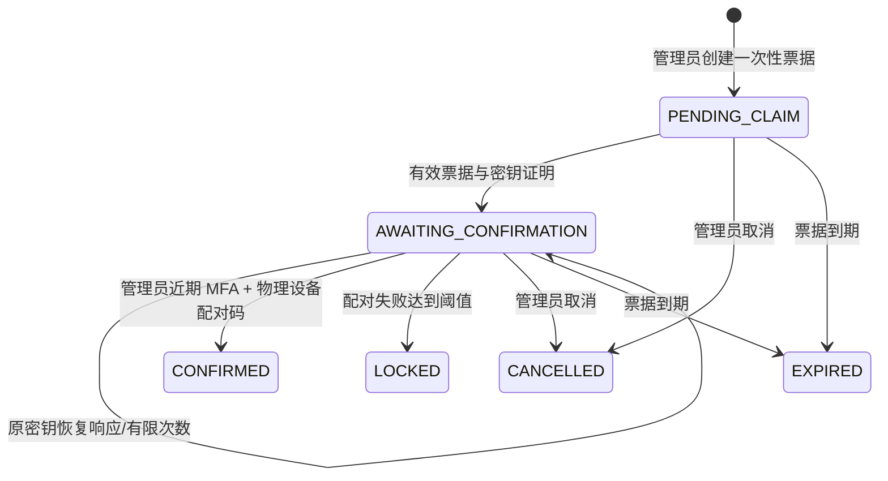

# 设备注册、独立身份与能力契约

> 更新：2026-10-08；状态：后端已实现，客户端、真实数据库/传输、EMM 和真机验收待完成。  
> 对应 DEV-01 / OFF-01、完整实施计划 Task 2。当前可注册 Android/Android TV **BYOD 有限模式**；全受管模式等待正式 EMM 执行路径。

## 1. 信任与状态

管理员 OIDC JWT 只用于管理路由。设备使用单独的随机 opaque bearer 凭证，绑定 tenantId、deviceId、registrationId 和 credentialId；Spring Security 的独立过滤链查询有效凭证事实，不信任客户端传入设备 ID。[Spring Security opaque token 扩展](https://docs.spring.io/spring-security/reference/6.5/servlet/oauth2/resource-server/opaque-token.html)

认领时使用 Nimbus 验证设备生成的 P-256 公钥及 ES256 密钥持有证明。它证明该注册请求持有私钥，不证明儿童身份、硬件真实性、DPC 权限或所有请求都使用硬件签名。当前设备 API 的凭证是 bearer，未宣称 DPoP/mTLS；生产必须通过 TLS，并由客户端安全存储保护凭证和设备密钥。[Nimbus EC 签名与验证](https://connect2id.com/products/nimbus-jose-jwt/examples/jws-with-ec-signature)



CONFIRMED 只表示云端设备绑定和凭证授权完成。Device.ACTIVE 不等于系统策略生效；当前 controlLevel 为 LIMITED，系统级规则均不能因此标记支持。失陷撤销只撤销远程访问，不表示本地 App、策略或数据已清理/擦除。

## 2. 管理接口

路径前缀 `/api/v1/tenants/{tenantId}`，Bearer 为管理员 JWT。

| 方法与路径 | 输入/输出 | 控制 |
|---|---|---|
| POST /enrollments | subjectId、requestedMode、platform → id、token、expiresAt、state | OWNER/GUARDIAN/ORG_ADMIN、近期 MFA、主体有效且同租户 |
| GET /enrollments/{id} | 安全 Enrollment 视图 | 管理范围；不含 token、pairingCode 或 credential |
| POST /enrollments/{id}/confirm | pairingCode → Device | 当前管理员与原授权者仍有权；近期 MFA；期限/状态校验 |
| DELETE /enrollments/{id} | 204 | 取消幂等；仅未确认状态；已有 pending 凭证同时撤销 |
| GET /devices | limit/cursor → ItemPage<Device> | 成人租户范围；CHILD 只看绑定主体设备 |
| GET /devices/{id} | Device + ETag | 同租户与儿童对象范围 |
| GET /devices/{id}/capabilities | CapabilityView.items | 证据来源、新鲜度、支持限制 |
| POST /devices/{id}/revoke | 204 | 有权成人、近期 MFA；注册凭证域及全部凭证立即撤销 |

创建示例（由真实主体 ID 替换占位符）：

```json
{
  "subjectId": "<subject UUID>",
  "requestedMode": "BYOD",
  "platform": "ANDROID"
}
```

platform 为 ANDROID/ANDROID_TV；requestedMode 还定义了 WORK_PROFILE/FULLY_MANAGED/DEDICATED，但当前无 EMM 实现时返回 422 CAPABILITY_UNSUPPORTED。电视注册只表示有限伴随应用绑定，不能阻断 HDMI、投屏、系统主页或其他输入源。

二维码/邀请码不可充当管理员认证。原票据只能认领一次；同一注册生成不可变 registrationId。转让/重新注册使用新注册周期，旧凭证、回执、额度和例外不能跨周期复用。

## 3. 认领与响应恢复

### 3.1 初次认领

`POST /api/v1/enrollment-claims` 不需要用户 Bearer，必须提交票据和完整密钥证明：

```json
{
  "enrollmentId": "<enrollment UUID>",
  "token": "<32-byte base64url enrollment secret>",
  "publicKeyJwk": "<public EC JWK JSON string>",
  "proof": "<ES256 compact JWT>",
  "displayName": "孩子的手机",
  "osVersion": "<reported OS version>"
}
```

使用成熟 JOSE 库生成证明；JOSE header 为 alg=ES256、typ=JWT，公钥仅 P-256，拒绝私钥及远程密钥引用/未知 critical 参数。JWT 内容为：

| claim | 规则 |
|---|---|
| sub | 精确 enrollmentId |
| aud | 仅 `ai-manager:enrollment-claim` |
| nonce | 精确一次性票据 token |
| iat / exp | 必填；有效窗口最大 120 秒；不接受过期或超出时钟容差 |
| jti | 新规范 UUID，按注册和用途持久去重 |

响应为 deviceId、registrationId、credential、expiresAt（设备凭证到期）、pairingCode、confirmBefore（票据确认期限）、state。客户端先持久保存设备密钥与响应，随后显示配对码。管理员从**物理设备屏幕**读取并输入配对码，不能只依据可伪造的设备名称判断身份。

管理员确认前凭证完全不能访问设备业务路由。初始票据、配对码及凭证只保存摘要，管理查询不回显秘密；普通幂等响应日志不存这些明文。

### 3.2 认领响应丢失

`POST /api/v1/enrollment-claims/recover` 需要 enrollmentId、原 token、同一个 publicKeyJwk 和**新签署** proof；不提交 displayName/osVersion。aud 改为 `ai-manager:enrollment-recover`，jti 为新 UUID。

- 仅 AWAITING_CONFIRMATION 且票据未到期、原授权/主体有效时允许。
- 公钥指纹必须与首次注册相同；仅拿到注册码不能替换密钥。
- 保持同一 deviceId/registrationId，撤销旧 pending 凭证并换发新凭证及配对码。
- 不延长确认期限、不重置配对失败计数。默认最多恢复 3 次，证明重放被拒绝。
- CONFIRMED、LOCKED、CANCELLED、EXPIRED 或失陷撤销后不允许此恢复；需要管理员新建受控注册流程。

恢复后客户端废弃旧响应，只展示新配对码。原私钥/原票据也丢失时不尝试绕过恢复限制。

## 4. 设备凭证与两阶段轮换

设备路由前缀 `/api/v1/device-api`，Bearer 为独立设备凭证。凭证数据库查询只返回匹配的有效注册上下文；家长 JWT 不能用于此路由，设备凭证不能用于用户/账单/租户管理路由。

| 方法与路径 | 用途 | 凭证要求 |
|---|---|---|
| POST /heartbeats | 完整能力快照与单调序号 | 当前 ACTIVE 凭证；业务事务内再次检查撤销 |
| POST /credentials/rotate | 暂存新凭证，返回 activateBefore | 当前 ACTIVE 凭证；同一旧凭证仅一个未结束轮换 |
| POST /credentials/activate | 新凭证确认，204；重复安全 | 暂存新凭证只获此用途权限；成功后旧凭证失效 |
| POST /credentials/rotation/cancel | 放弃未确认轮换，204 | 原 ACTIVE 凭证；幂等，旧凭证仍可用 |

客户端轮换：旧凭证申请 → 原子保存新凭证为 pending → 使用新凭证确认 → 成功后切换 active 并清理旧值。确认响应丢失可以用新凭证重试；申请响应丢失可以用原凭证取消或等暂存到期后重新发起。

新凭证在确认前不能心跳或执行业务。暂存到期只使该新凭证不可用，不提前撤销旧凭证；旧凭证自身期限不会因此延长。轮换确认、取消、撤销共享注册域行锁，避免并发产生多个有效最终凭证。私钥更换流程尚待实现，不能把 bearer 轮换称为公钥轮换。

## 5. 心跳、能力与观察状态

```json
{
  "sequence": 1,
  "agentVersion": "1.0.0",
  "capabilities": [
    {"key": "usage.report", "reportedSupported": true, "grantStatus": "GRANTED"}
  ]
}
```

sequence 必须 1～9007199254740991，客户端跨重启持久化；服务端不从重启事件补满额度或重置序号。最多 64 条唯一小写 capability key，reportedSupported 与 grantStatus 明确提供。grantStatus 支持 GRANTED/DENIED/NOT_REQUESTED/REVOKED/NOT_APPLICABLE。

同序号同规范化请求返回原 receivedAt，不刷新证据；同序号异内容 409 HEARTBEAT_SEQUENCE_CONFLICT，旧序号 409 HEARTBEAT_STALE_SEQUENCE。新序号替换完整快照，省略/撤回项不会沿用旧授权；批量 JDBC 写入与心跳状态同事务。

能力视图区分：

- 系统管理项在 BYOD 下为 UNSUPPORTED；自报 true 不能提升模式。
- 获准观察项仍为 UNVERIFIED，证据来源 AGENT_REPORT，不宣称供应商/平台认证。
- 未知 key 为 UNKNOWN，老证据为 STALE；当前 effectiveSupported 不授予系统强能力。
- 观察 RECENT/STALE/UNKNOWN 与注册 ACTIVE/REVOKED 分开；近期心跳不代表策略正在生效。

策略/EMM 模块后续必须增加可靠执行证据来源及规则级结果，不能直接消费 reportedSupported 作为管控授权。

## 6. 配置与数据

| 环境变量 | 默认 | 校验 |
|---|---|---|
| DEVICE_ENROLLMENT_LIFETIME_SECONDS | 900 | 60～3600 |
| DEVICE_CREDENTIAL_LIFETIME_SECONDS | 604800 | 3600～2592000 |
| DEVICE_ROTATION_LIFETIME_SECONDS | 300 | 30～600，且不超旧凭证期限 |
| DEVICE_MAX_PAIRING_FAILURES | 5 | 1～10 |
| DEVICE_MAX_RECOVERY_ATTEMPTS | 3 | 1～5 |
| DEVICE_OBSERVATION_MAX_AGE_SECONDS | 180 | 30～86400 |
| DEVICE_CAPABILITY_MAX_AGE_SECONDS | 900 | 30～86400 |

V4～V6 管理 enrollment、device、credential、credential scope、rotation、capability、proof ledger。核心关联采用复合租户外键；每个注册域独立行锁，权限关系在事务中锁定，确认时按固定身份键顺序锁原授权人与确认人。

凭证使用标准 SecureRandom 和 SHA-256，JOSE 验证使用显式声明的 Nimbus SDK（当前与 Spring Security 6.5.11 对齐为 9.37.4）。依赖安全/许可全量扫描仍属于发布门槛，不因一项库或 H2 回归通过宣称完成。

## 7. 验证证据与剩余范围

自动化覆盖跨租户主体、过期/重复/并发认领、私钥/错误密钥/nonce/audience/期限证明、管理员/儿童边界、配对锁定、丢失响应恢复及反重放、独立路由认证、轮换/取消/到期/撤销、心跳重复/乱序、能力过期/未知及 OpenAPI 安全方案。

当前仍缺真实 MySQL/OceanBase 事务和迁移验收、TLS/客户端安全存储、设备硬件证明/密钥更换、注册/凭证/证据保留与过期作业、接口速率治理、正式 EMM/DPC、Kotlin/TV 真机和策略执行。受管模式不得提前开启。详见[实施记录](implementation-progress.md)。
