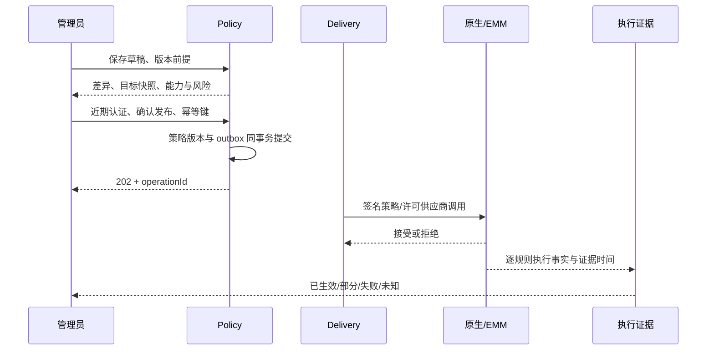

# 智能管家：产品实施、商业交付与功能闭环

> 版本：Draft 1.1；更新：2026-10-09。  
> 配套：[平台蓝图](parental-control-platform-design.md)、[功能规格](parental-control-functional-spec.md)、[商业规格](parental-control-commercial-spec.md)。  
> 本文是实施契约。代码与环境的实际进度以[实施记录](implementation-progress.md)为准，不能用规格清单代表功能已交付。

## 1. 产品定义与交付单位

产品承诺为：管理员可以制定规则，看到支持范围和执行证据；儿童可以理解规则、申请例外和求助；家庭与机构可以安全恢复、迁移和退出管理。强制执行承诺必须绑定经验证的管理模式和型号。

每个交付单位包含六项：功能编号、业务流程、管理端/被管理端入口、后端契约、设备或供应商执行适配、验收证据。纯报表或账单功能不要求设备执行，但必须证明数据来源和授权。

### 1.1 全量功能与闭环对应表

| 功能 | 管理端 / 儿童端流程 | 主要业务对象 | 完成时必须证明 |
|---|---|---|---|
| IAM-01 | 登录、近期认证、角色预览 / 自身登录 | Principal、Membership、AuthContext | JWT 验签/issuer/audience、撤权立即生效、对象范围隔离 |
| FAM-01 | 创建、邀请、撤销、主体编辑、交接 / 查看自身规则 | Tenant、Subject、Invitation、Transfer | 一次性邀请、版本并发、原管理员权限交接与审计 |
| DEV-01 | 添加设备、模式解释、管理员确认 / 注册向导 | Enrollment、Registration、Capability | 一次注册周期、独立凭证、真实能力与健康状态 |
| APP-01 | 应用目录、安装/启动规则 / 允许应用、拦截原因 | AppIdentity、AppInventory、AppRule | 每种模式执行及撤销结果；安装、卸载、启动不混为同一权限 |
| PER-01 | 敏感权限现状、许可策略 / 用途告知 | PermissionRule、GrantEvidence | 系统权限与特殊授权的分别支持情况，拒绝后如实显示 |
| SCH-01 | 学习/睡眠/休息计划 / 下次开放时间 | Schedule、Calendar、TimeEvidence | IANA 时区、DST、假期、连续使用与必要联系例外 |
| QUO-01 | 单设备/共享额度 / 余额与申请 | QuotaPool、Lease、UsageLedger | 并发不超发、重复结算安全、不确定离线消费不重发 |
| POL-01 | 草稿、差异预览、发布、回滚 / 规则解释 | PolicyVersion、TargetSnapshot、RuleResult | 不可覆盖底线、不可变版本、逐规则实际状态 |
| APR-01 | 待审批、限时决定 / 申请、进度、结果 | AccessRequest、TemporaryGrant | 终态唯一、审批者撤权、绝对到期、批准与设备生效分开 |
| TVS-01 | 配置访客/成人会话 / 遥控首页、扫码申请 | DeviceSession、AdultSessionRequest | 不信头像身份、焦点可达、Home/投屏/HDMI 边界 |
| WEB-01 | 分类、例外、来源 / 拦截说明、误分类申诉 | DomainRule、CategoryEvidence、FilterAdapter | 覆盖和旁路实测、HTTPS 内容不可见范围、不自装根证书 |
| SAF-01 | 风险复核、恢复 / 紧急帮助 | RiskEvent、RecoveryOperation、Notification | 未知不算安全、求助路径可达、恢复授权和结果证据 |
| ORG-01 | 班级、设备组、批量操作 / 课堂状态 | Group、Class、Roster、ClassSession | 教师只操作获授范围、部分失败可追踪、课后到期 |
| EXT-01 | IdP/名册/EMM 集成 / 必要告知 | Connector、SyncJob、ExternalMapping | 来源可信、撤销与同步冲突处理、无跨租户关联 |
| INS-01 | 趋势解释、建议 / 自身摘要 | UsageAggregate、Coverage、Suggestion | 不完整数据显式标记、无医学诊断、建议可拒绝 |
| VIS-01 | 独立授权、模型说明 / 前台开关、撤回 | ConsentReceipt、ModelVersion | 默认关闭、停止采集、无原始视频留存、无身份/情绪推断 |
| AIA-01 | 生成草稿、编辑、认证发布 | DraftSuggestion、ValidationResult | 模型不能直接执行；越权、注入和不支持字段被拒绝 |
| RPT-01 | 报告、导出、删除、诊断 / 自身摘要 | ReportJob、Export、DeletionRequest、SupportGrant | 每次下载授权、到期清理、备份再删除、诊断脱敏 |
| OFF-01 | 查看最后证据、恢复步骤 / 离线解释 | Checkpoint、ClockState、PendingReceipt | 不自动延长例外、重启不补满额度、联网对账 |
| END-01 | 后果预览、退出、撤销、转让 / 退出说明 | Deprovision、CleanupChannel、Revocation | 清理/撤销/擦除分别确认；离线不假报成功 |
| COM-01～03 | 体验、购买、续费、取消、降级 | Catalog、Order、Subscription、Entitlement | 支付事实可验证、重复不多授、权益不越过能力和授权 |
| COM-04～06 | 采购、试点、交付、许可、支持 | Contract、DeliveryAcceptance、License、SupportCase | 可售兼容清单、责任边界、升级恢复与合同退出 |

## 2. 产品信息架构与操作边界

### 2.1 各端入口

| 产品界面 | 导航 | 关键限制 |
|---|---|---|
| 监护人手机/平板 | 今日、孩子、设备、规则、申请、安全、报告、家庭、服务 | 修改前显示范围；再次认证在服务端核验；高影响变更先预览 |
| 机构 Web/桌面 | 概览、组织/班级、设备/组、策略、批量任务、审批、集成、审计、交付 | 表格默认不展示儿童自由文本；教师操作按班级/设备范围 |
| 儿童手机/平板 | 可用应用、今日安排、剩余时间、我的申请、规则说明、求助 | 无角色、注册模式和套餐修改入口；直接 API 越权也拒绝 |
| 电视 | 允许应用、当前会话、剩余时间、申请、管理员扫码、求助 | 每项支持 D-pad；扫码过期可重试；管理员密钥不输入到电视 |
| 平台运营 | 兼容目录、发布、租户健康、产品目录、账单、支持、事件、数据请求 | 运维、财务、渠道和儿童数据查看分别授权 |

导航入口表示功能归属，不要求一屏放满。儿童端限制页优先解释“原因、何时恢复、申请与求助”；管理员页优先呈现“期望规则、实际结果、证据时间、可采取操作”。

### 2.2 通用页面状态

每个数据页提供加载、空态、错误、离线、部分数据、无权限、能力不支持、需授权、需认证、版本冲突和操作处理中。每个状态有稳定代码、短解释和可执行下一步。

- 切换 tenant/subject 后先清除旧视图，缓存以身份、租户、对象、接口版本分区；注销和撤权清理敏感缓存。
- 规则页面不采用“提交即成功”的乐观更新。后台保存成功、供应商接受、设备应用成功分别反馈。
- 管理者重试前看到已有 operationId；批量任务可关闭页面继续查询，不重新发起整个任务。
- TV 所有弹窗可返回；系统设置等必要恢复通道按平台和管理模式设计，不依赖屏幕触摸或鼠标。
- 字号、读屏、对比度、键盘和遥控焦点是设计验收项；警告不能只用红色表示。

## 3. 关键实施流程及故障处理

### 3.1 家庭激活与管理员交接

1. 身份服务核验成人资格与登录；创建区域内租户和 OWNER 关系。
2. 创建最小儿童主体；邀请共同监护人，绑定已验证的收件身份与一次性期限。
3. 添加设备，披露控制模式；发布基础规则，验证必要恢复路径。
4. 交接采用双方确认：现任 OWNER 近期认证提交目标成员与权限差异 → 目标成人近期认证接受 → 同事务更换唯一 OWNER → 撤销旧 OWNER 的额外提升与未执行敏感操作。
5. 转移邀请过期、目标被移除、原所有者撤权或租户版本变化均需重新发起。交接不自动转移付款责任和财务发票。

争议、失联和账号恢复走独立核验；客服不以付款截图直接转移儿童数据。儿童主体归档、管理解除、账户关闭和法定删除是四种不同操作。归档不取消已有设备策略，不代表删除账本/审计。

### 3.2 注册、认领与能力确认

管理员发起 enrollment → 限时码认领 → 原生层生成设备密钥并证明持有 → 管理员确认待绑定设备 → 服务签发独立 registration 身份 → 如需 EMM 则完成供应商注册 → 汇总能力与证据 → 基础策略发布。

认领码不能直接授予“系统受管”标记；设备自报型号/权限只是待验证证据。码泄露时可撤销整个 enrollment；并发认领仅一个成功。网络中断可查询已持久化结果，不能无限重复发放密钥或保存原始注册秘密到普通幂等日志。

同一设备恢复出厂/转让后创建新注册周期，旧凭证、额度租约、临时授权与执行回执不能跨周期复用。供应商凭据仅保存在服务端密钥存储，不能发给伴随应用。

### 3.3 策略发布和规则执行证据

- 预览包含目标成员、设备模式、规则数、能力缺口、不可覆盖底线、权限及实际数据后果；绑定预览哈希和到期时间。
- 发布时重验授权、目标版本、基线与能力；显著改变后重新预览，不能沿用旧确认。
- 批量目标冻结为快照，新增入组设备按独立绑定任务处理。任务分母、取消点与超时固定，避免执行率因目标变化虚高。
- 取消任务停止尚未提交的设备命令；已提交系统操作可能无法取消，展示真实结果并发起补偿任务。
- 回滚生成新版本，不覆盖历史；失败时保留最后可验证基础策略及独立恢复通道。

### 3.4 临时访问与共享额度

申请包含对象、应用、原因类别、时限和额度；自由文本可选并限制长度/保留。审批时验证决定者当前范围与近期认证，双人审批由租户配置控制；通知送达不等于审批完成。

审批终态唯一；批准生成有限 TemporaryGrant，绑定注册周期、绝对 notAfter、maxUsageSeconds 和规则范围。不同设备不复制全部共享剩余额度。服务端事务预留租约，本地计时消费，累计结算幂等。未能证明未使用的离线预留额不能因租约消息超时重新发放。

电视访客使用访客基线。选择孩子头像只能表示自报身份；归属不可信时不对该孩子提供硬共享额度保证。成人扫码确认后的会话有独立期限，重启/退出会话恢复儿童或访客基线。

### 3.5 机构批量部署与课堂

名册导入先校验、预览重复/缺失/外部映射 → 人工确认 → 异步导入 → 对账。同步停用不直接擦除设备或删除儿童历史；由管理员进入停用/退出流程。

全校策略按试点设备组、年级/班级、全量逐批发布，批大小与供应商速率配置化。教师临时课堂会话限定授课范围、起止时间和允许应用；不能改租户安全底线、下载家庭报告或延长已到期授权。

### 3.6 告警、恢复与解除管理

先识别事实（离线、权限撤回、供应商失败、未验证行为），再根据规则严重度产生事件。相同设备/类别合并短期重复事件，提供静默窗口与升级规则；紧急求助单独处理，通知内容不含儿童敏感活动。

恢复需要独立权限、认证、期限和审计；本地恢复码必须可撤销、限用途，不能长期存储统一管理员 PIN。解除管理先预览真实模式后果、确认、异步执行，再按证据记录本地清理。失陷撤销立即拒绝远程访问，即使清理未确认仍保留“残留状态未知”。

## 4. 领域模块与接口实现规则

| 领域 | 拥有的数据与责任 | 允许通过公开契约调用 |
|---|---|---|
| Identity/Tenancy | 身份信任、角色与对象关系 | requireRole/requireWriteRole、近期认证证据 |
| Fleet/Integration | 设备注册、能力、供应商映射 | 有效注册、能力查询、执行适配器 |
| Policy/Schedule | 不可变策略、时间语义、目标快照 | 编译、预览、发布与回滚请求 |
| Delivery | 命令、outbox、回执、重试 | operation、规则结果、投递事件 |
| Approval/Quota/Session | 临时授权、额度账本、可信会话 | 决定、租约、累计结算与会话审批 |
| Safety/Reporting/Retention | 风险、聚合、导出和删除作业 | 范围报告、异步作业、恢复请求 |
| Billing/Entitlement | 购买事实、合同、目录、权益 | 当前权益；不持有设备执行权限 |
| Consent/Insight/Assistant | 用途授权、模型、建议草稿 | 授权检查、经过校验的草稿 |

模块化单体中各模块拥有 repository，其他模块不直接写其表。公开接口保持窄边界；异步事件使用有版本的数据契约。应用启动/CI 用 Spring Modulith 验证边界，拆服务前先有伸缩或故障隔离证据。

### 4.1 REST 与消息契约

- 管理接口为 `/api/v1/tenants/{tenantId}/...`；对象 ID 不能代替授权。用户与设备 audience、凭证、路由和速率策略分别设置。
- `If-Match` 使用强版本 ETag；缺失返回 428，陈旧返回 412；不接受 `*` 绕过并发保护。敏感字段变更独立认证。
- 创建/发布用持久幂等键：租户、精确操作者身份、操作、键哈希唯一；同键异载荷返回 409。重试仍重新鉴权，不能读取撤权前的缓存响应。
- 秘密只返回一次的注册/邀请使用专门可恢复流程；普通幂等响应库不保存设备私钥、注册秘密或邀请 token。
- 202 必须有 operationId、查询入口与截止时间；错误包含稳定 code、messageKey、correlationId 和可重试指引，不回显 SQL、凭据或儿童自由文本。
- MQTT/事件包含 schemaVersion、tenantId、registrationId、commandId、policyVersion、issuedAt、notAfter、traceId。消费者验证认证上下文、目标、签名、版本与重放边界。
- QoS/消息收件回执只说明投递；系统生效以许可原生/供应商证据为准。无法执行的规则返回能力失败，不能默认为通过。

当前可生成的 OpenAPI 只包含实际控制器；规划 API 保留在规格和计划中。springdoc 版本按 Spring Boot 兼容矩阵锁定，生产默认关闭文档入口，启用时仍需鉴权。[springdoc 官方兼容说明](https://springdoc.org/v2/)

### 4.2 MySQL/OceanBase 数据库实施补充

**默认决定仍为 MySQL 8.4 LTS。** 单纯设备注册数不能说明需要 OceanBase；优先量化在线写入、事务热点、存储、可恢复性及总成本。OceanBase 在目标版本/edition、驱动、DDL、事务和运维认证通过后开放部署 profile，其 MySQL 模式存在明确兼容差异。[OceanBase 官方兼容对比](https://www.oceanbase.com/en/docs/common-oceanbase-database-standalone-1000000006076943)

| 数据类型 | 建模规则 | 必需验收 |
|---|---|---|
| 外部身份 | 原始 OIDC sub 仅作已授权显示/审计；索引采用精确身份稳定键 | 大小写、Unicode、不同 issuer 不混同 |
| 租户关联 | `(tenant_id, id)` 复合键和关联条件 | 不同租户相同外部映射不能错连 |
| 金额/额度 | 整数最小单位/明确 Decimal；秒数整数且有上限 | 溢出、负值、重复扣减和并发超发 |
| 时间/日程 | UTC 瞬时与 IANA 日程时区分开 | DST、精度、服务器时钟和跨日边界 |
| 策略/命令 | 不可变版本、唯一命令与状态前提 | 并发发布、重复/乱序回执和回滚 |
| 遥测/报表 | 追加事实、注册周期和序号去重、聚合口径 | 不依赖全量报表 JOIN 服务核心写入 |
| 幂等/outbox | 同业务事务落库，索引扫描受限 | 提交状态未知、服务重启和故障切换 |

MySQL 默认字符集/排序规则为 `utf8mb4` / `utf8mb4_0900_ai_ci`；身份不能直接以默认文本等值判断。当前单 issuer 代码对精确 sub 使用 SHA-256 标准库生成索引键；这不是认证凭据。支持多 issuer 前必须将经过验证的 issuer 纳入身份命名空间并迁移已有关系。[MySQL 字符集与排序规则](https://dev.mysql.com/doc/refman/8.4/en/charset.html)

新库迁移在上线前可整理；已发布迁移不可改 checksum。升级走 expand → backfill → 校验 → 切换读取 → contract。MySQL → OceanBase 切换采用成熟迁移工具、全量/增量对账、写入冻结/受控切换；不自研无限双写。切换后回退若有新增写入必须有反向同步方案，不能仅切回旧连接串。

核心授权、额度和策略版本读取主事实源。Redis 只作为可失效缓存与限流，不作为永久身份/余额账本。H2 用于快速行为验证，不能代替 MySQL/OceanBase 的锁、排序规则、DDL、计划、HA 与备份恢复验收。

## 5. 商业化与交付的操作闭环

### 5.1 目录上架

每个 SKU 绑定产品线、区域、购买渠道、目录版本、功能权益、容量、历史期限、供应商费用口径、支持级别、兼容证据和退役通知期。上架流程为草稿 → 产品/技术核验 → 财务/商务核验 → 区域发布条件核验 → 发布生效。

可售规则同时验证技术支持、授权、业务状态和权益。兼容目录更新可让功能显示“需重新验证”，但不能伪造历史执行失败或静默扩大权限。存量合同的商业变化采用明确生效日期及预告；紧急技术停售与客户补救方案分别记录。

### 5.2 机构售前至回款

商机 → 型号/区域/模式核验 → 技术试点 → 成本报价 → 合同/采购订单 → 租户开通 → 分批实施 → 培训/签收 → 发票/回款对账 → 健康复盘 → 扩容/续约或退出。

销售不能写数据库绕过 entitlement；开通必须由合同批准事件触发并可审计。签收记录按功能编号、设备范围、版本、支持条件和已知限制建立；商务签署与技术证据分别留存。账单争议不会直接擦除设备或撤销管理员求助能力。

### 5.3 渠道、财务与支持分权

| 操作 | 主责任 | 审核或授权 | 禁止合并的权限 |
|---|---|---|---|
| 调整有效合同权益 | 商务/客户成功 | 财务及产品负责人 | 不能同时隐藏变更审计 |
| 退款/贷项 | 财务 | 按金额配置审批 | 不授予设备擦除或儿童记录查看 |
| 客户诊断 | 支持 | 客户限时 support grant | 渠道销售关系不构成诊断授权 |
| 受管解除/擦除 | 客户有权管理员 | 近期认证、真实后果确认 | 客服不能代替设备所有者授权 |
| 区域数据迁移 | 交付/SRE | 客户数据责任人与安全负责人 | 不按营销分组搬迁儿童数据 |
| 新型号认证 | 平台/QA | 产品上架审批 | 供应商营销材料不能代替真机证据 |

### 5.4 健康度与单位经济

租户健康度输入为基础激活完成、规则证据覆盖、待修复授权、失败任务、必要恢复、支持问题与订阅/合同状态。数据缺失单列，不把“离线多”直接解释为儿童违规或低付费价值。

单位经济模型分别核算家庭、机构、私有部署和 OEM：净确认收入、直接云/供应商/支持成本、实施摊销、渠道费用、退款与研发分摊。价格实验只针对成人；免费恢复和儿童帮助入口不用于诱导付费。

质量指标包括误封学习/联系、解释理解度、审批生效时间、恢复成功与授权撤回；商业指标包括成人试用转化、续费、机构验收周期、应收账龄、单位服务成本。指标均定义分母、数据覆盖、渠道/区域、采集用途、保留与负责角色。

## 6. 工程交付和运行流程

### 6.1 标准开发流水线

需求 ready（流程、范围、异常、编号明确） → API/schema review → 行为测试失败证据 → 实现 → 模块/契约/数据库回归 → Flutter/原生与供应商验证 → 安全与许可证治理 → staging 演练 → 产品签收 → 区域小批量发布 → 指标复盘。

优先成熟框架/SDK 承担身份、加密、存储、消息、迁移、推理和支付。自定义代码承担监护关系、策略语义、额度、审批、证据与产品流程；不能用“不要自研”跳过这些业务不变量。

接口、字段和配置注释解释单位、允许值、范围、前置条件、重试语义和敏感性。日志记录操作类型、稳定错误、版本与关联 ID；禁止原始视频、凭据、支付秘密和儿童自由文本。保留、速率、重试、批大小、阈值、渠道及地区开关均配置化且有校验。

### 6.2 故障时的产品与运维响应

| 故障 | 产品表现 | 后端/运维动作 |
|---|---|---|
| 身份服务不可用 | 已验证会话按原有效期使用；新登录/近期认证受限 | 缓存公钥按标准行为处理，不能关闭 JWT 验签 |
| 数据库故障 | 写入失败或状态待查询；不显示成功 | 保护连接池、幂等查询、按 HA runbook 恢复 |
| Broker/EMM 中断 | 待投递/供应商失败；最后生效证据保留 | outbox 保留、退避、配额隔离、死信对账 |
| 分类/AI 服务中断 | 已有许可配置运行；草稿/建议不可用 | 熔断、预算、禁止未校验输出成为策略 |
| 支付回调延迟 | 等待验证；已确认权益按配置处理 | 持久收件、官方 API 对账、人工授权补偿 |
| 重连风暴 | 在线恢复分批、证据逐步刷新 | 随机抖动、每租户速率、增量同步和背压 |
| 地区故障 | 状态页明确影响区域 | 恢复符合驻留与密钥边界，不自动跨区复制敏感数据 |

每个 runbook 必须有触发器、影响范围、诊断查询、恢复步骤、数据一致性核验、退出条件和负责团队。对外 SLA 只能使用经过负载与值班能力验证的指标。

## 7. 上线验收与退役

每个功能维护一行 Requirement → API/schema → UI → adapter → test → evidence → SKU 对应关系。状态为 PLANNED、IN_PROGRESS、AUTOMATED_VERIFIED、DEVICE_VERIFIED、PILOT、GA、SUSPENDED、RETIRED，且绑定环境和型号；后端测试成功只能支持 AUTOMATED_VERIFIED。

发布包包含版本锁定、数据库 profile、配置 schema、兼容清单、供应商依赖、迁移/恢复方案、许可证/SBOM、用户帮助、支持手册、数据请求及退出方案。摄像头和 AI 通过独立开关、授权与质量评估上线。

退役先披露受影响型号/版本、剩余基础能力、升级或解除方式及合同处理；管理员确认后转移/退出。停止云服务前验证离线设备恢复方法与数据导出，不承诺云服务永久停机后仍可远程管控。

## 8. 当前代码与下一步的对应关系

目前后端已落地租户创建/列表、儿童主体创建/列表/详情/版本编辑/归档、成员邀请/接受/撤销、邀请取消、近期 MFA、范围授权、持久幂等、事务审计、错误与关联日志、生成 OpenAPI。实际测试结果见实施记录。

设备注册、独立身份、心跳/能力与恢复接口见[设备接入](device-registration-contract.md)。应用/时间/策略配置见[策略契约](policy-application-schedule-contract.md)，签名配置拉取/回执和通知适配见[交付契约](configuration-delivery-contract.md)；保存配置、设备自报保存与实际系统执行分别报告。自动化证据见实施记录。

云端访问申请、限时决定、取消/撤销、到期和基础/主体/注册/成员失效见[审批契约](access-request-contract.md)。当前结果为 APPROVED_PENDING_DELIVERY / NOT_ENFORCED，不作为应用解锁、使用额度追加或设备清理证据。

尚待实现或环境验证：完整交接/机构范围、正式受管设备执行、额度、Flutter/Android/TV、内容、报告/删除、商业支付、智能辅助、部署/容量，以及真实 MySQL/OceanBase/OIDC/Broker/供应商/真机证据。全部保留在[完整实施计划](implementation-plan.md)，不缩减产品范围。

## 9. 增强实施规格的使用方式

使用[完整产品交付与商业运营模型](parental-control-product-operating-model.md)的功能工作包补齐每项任务的界面、后端、执行器、异常、证据与商业映射。临时批准不等于设备解锁，批量取消不等于回滚已完成项，套餐升级不等于系统权限提升。

使用[数据库实施与认证规格](database-implementation-and-certification.md)落实表与索引、聚合事务、负载、目标 profile、迁移和恢复。测试环境、真实数据库、Broker/EMM、真机与客户签收分别形成证据，不互相替代。
