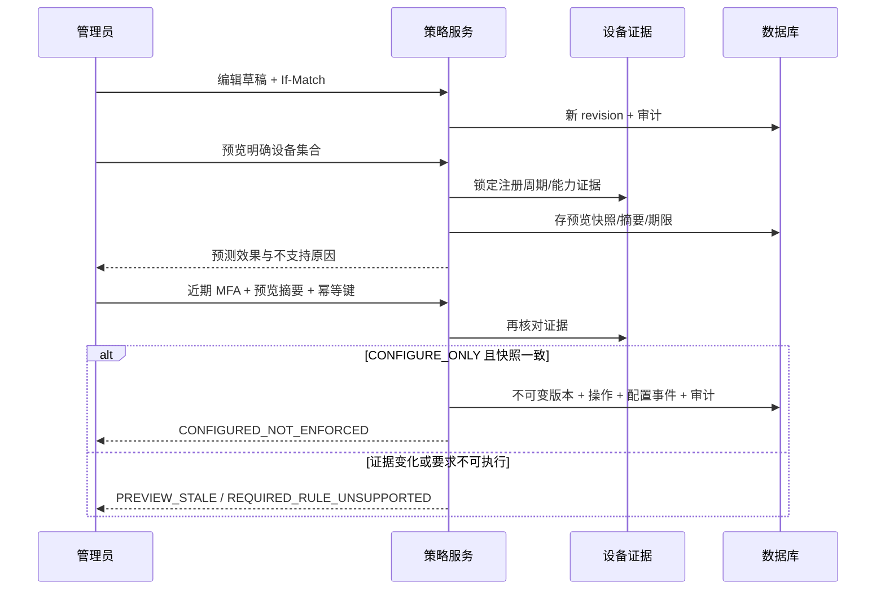

# 应用、时间计划与策略实施契约

更新日期：2026-10-09。本文记录实际后端实现，配合[平台蓝图](parental-control-platform-design.md)、[设备接入契约](device-registration-contract.md)和[实施记录](implementation-progress.md)阅读。

## 1. 当前交付边界与产品展示

已实现声明式应用身份、时间计划、策略/模板草稿、冲突预览、配置版本、发布操作查询与回滚草稿。设备应用清单的云端上报契约见第 7 节；设备级签名配置/回执及通知适配层见[交付契约](configuration-delivery-contract.md)。客户端采集/验证、Flutter 编辑器、系统拦截、供应商执行和真实 Broker/MQTT 仍需实现及独立验收。

- `CONFIGURE_ONLY` 的结果固定为 `CONFIGURED_NOT_ENFORCED`，代表配置与审计已保存。界面按钮应写“保存配置版本”，结果应写“已保存，未执行”。
- `ENFORCE` 在必需规则不支持时返回 422 `REQUIRED_RULE_UNSUPPORTED`；即使未来能力校验通过，当前没有执行适配器，返回 503 `DELIVERY_ADAPTER_NOT_CONFIGURED`。
- 预览的 `effectiveEffect` 为 null；`predictedEffect` 不能充当设备执行证据。当前没有 `APPLIED`、全设备已保护或系统权限已授予的成功状态。
- 受管模式仍待正式接入。管理员声明应用信息、代理报告签名、普通应用可见清单和用户角色不能提升设备系统能力。
- 家长界面应展示每条失败原因、证据时间与适用范围；商业权益不能把“不支持/未配置”变为“可执行”。

## 2. 应用与时间计划

所有管理路径带 `/api/v1/tenants/{tenantId}`；OWNER/GUARDIAN/ORG_ADMIN 可创建，AUDITOR 可只读。儿童不能读取租户全局草稿、模板和目录；其自身设备清单按主体范围单独授权。

| 方法与后缀 | 数据 | 语义 |
|---|---|---|
| POST /applications | displayName、platform、packageName、profile、signingDigests | 声明应用；可选 Idempotency-Key；201 |
| GET /applications | limit、cursor | 按 ID 分页 |
| GET /applications/{applicationId} | ApplicationDefinition | 仅本租户 |
| POST /schedules | name、definition | 不可变时间计划；可选幂等；201 |
| GET /schedules | limit、cursor | 按 ID 分页 |
| GET /schedules/{scheduleId} | ScheduleEntry | 仅本租户 |
| GET /schedules/{scheduleId}/evaluation?at=ISO_INSTANT | Decision | 计算允许时段，供预览使用，不执行系统动作 |

应用身份由 platform、精确 packageName、profile 与排序后的 signingDigests 共同确定；租户内摘要唯一。同身份重复创建 409 `APPLICATION_IDENTITY_EXISTS`。名称不是身份，签名集合不是经过验证的更新 lineage。profile 为 PRIMARY/WORK/SECONDARY/UNKNOWN；当前非 PRIMARY 的执行范围未验证。声明为 ANDROID 的记录不会自动覆盖 ANDROID_TV。

签名摘要最多 8 个，为小写 SHA-256 十六进制；未知签名可传空集合，不会因此获得认证状态。当前 `evidenceStatus=ADMIN_DECLARED`，既不证明已安装，也不提供内容安全评级。应用与计划定义不可原地改写；变更时建立新 ID，再编辑策略引用。

时间定义示例：

```json
{
  "name": "学习日娱乐时段",
  "definition": {
    "timeZone": "Asia/Shanghai",
    "weekly": [
      {"day": "MONDAY", "start": "18:00", "end": "19:00"},
      {"day": "FRIDAY", "start": "22:00", "end": "01:00"}
    ],
    "exceptions": [{"date": "2026-10-09", "windows": []}]
  }
}
```

时间语义：

- 窗口为 `[start,end)`；end 早于 start 表示跨午夜。相同端点拒绝，避免混淆零时长与全天。
- 使用 IANA `ZoneId` 和运行时 TZDB；时间按 HH:mm 输入。weekly 最多 56 个，日期例外最多 366 个，每日期最多 8 个窗口。
- 日期例外替换该日期的允许窗口；空例外关闭整个日期，包括前一晚的跨日延续。
- 夏令时跳过的边界归到下一个有效瞬间；完全处于缺口的窗口为空。重复时间按两个实际区间计算，不填充中间的禁止分钟；也支持非整小时切换。
- `evaluation` 返回 allowed、currentUntil、nextAllowedAt、localDate、reasonCode 和 previewDays=8。查询日期为 1900～2200；八日内没有下次允许时间不表示永久没有窗口。
- 这个计算器不扣减额度，不证明设备时钟可信，也没有自动处理时区修改的额度续期；额度账本与原生可信计时属于 Task 6/8。

## 3. 规则模式与冲突

一个草稿最多 100 条规则。rule.id 必须唯一；kind/effect/required 为必填。无关字段、未知字段、重复 JSON 属性、字符串布尔值和浮点整数均拒绝。

| kind | effect | 附加字段 | 当前编译能力键 |
|---|---|---|---|
| APP_LAUNCH | ALLOW/DENY | applicationId | app.launch_block |
| APP_INSTALL | ALLOW/DENY | applicationId | app.install_policy |
| APP_UNINSTALL | ALLOW/PROTECT | applicationId | managed.app_policy |
| RUNTIME_PERMISSION | GRANT/DENY/DEFAULT | applicationId、permission | permission.runtime |
| SPECIAL_ACCESS | GRANT/DENY/DEFAULT | applicationId、permission | permission.special_access |
| DAILY_QUOTA | LIMIT | seconds，applicationId 可选 | usage.shared_quota_enforced |
| TIME_WINDOW | ALLOW | scheduleId，applicationId 可选 | usage.schedule_enforced |
| DOMAIN_ACCESS | ALLOW/DENY | domain | network.domain_filter |
| USAGE_REMINDER | REMIND | seconds，applicationId 可选 | usage.reminder |

`seconds` 为 1～86400 的整数。`applicationId` / `scheduleId` 如提供，必须为规范小写 UUID；引用使用完整 ID 匹配，不接受大小写别名。applicationId 缺省的额度/窗口指总范围，仍必须保留恢复应用豁免。runtime permission 接受登记的 Android 危险权限名称；版本、目标 SDK、厂商与受管能力仍由后续原生适配器核验。SYSTEM_ALERT_WINDOW 等不能冒充 runtime permission。special access 的名称为 USAGE_ACCESS/OVERLAY/NOTIFICATION_ACCESS/ACCESSIBILITY/VPN；声明 GRANT 不会自动完成系统用户操作。

domain 只接受小写标准 ASCII/punycode DNS 名，不接受 URL、IP、尾部点或通配符。Unicode 名称需先 IDN 转换。域名规则不读取 HTTPS 页面内容，不提供所有媒体应用内部内容审查。

同类型、同应用/权限/域名/计划的规则合并：DENY 优先；卸载保护 PROTECT 优先；权限冲突 DEFAULT 比 GRANT 更保守；额度取更小值；required 只要有一条为 true 就保持必需。不同计划保留为独立限制，下游需求交集，不能当成允许窗口的并集。应用 ALLOW 也不覆盖总额度或时段限制。

警告包括 SAME_LAYER_CONFLICT_RESTRICTIVE_WINS、SMALLER_QUOTA_WINS、INSTALL_DENY_MAY_REMOVE_EXISTING_APP 和 SYSTEM_USER_ACTION_REQUIRED。安装 DENY 与临时启动 DENY 是不同操作；尚未接通安装/移除的供应商后果确认流程，不能发出不可逆执行。

恢复底线默认保护 com.android.settings、com.android.dialer、com.google.android.dialer、com.aimanager.device 和 com.aimanager.guardian。不能阻止这些声明应用启动/安装、按额度/时段限制它们或放开其卸载。`POLICY_ADDITIONAL_PROTECTED_PACKAGES` 仅增加豁免，不移除默认项；快照携带完整列表。厂商拨号器、系统紧急入口及最终真实客户端包名还需兼容验证，不能将这份名单当作已完成真机恢复保障。

## 4. 草稿、模板与预览接口

| 方法与后缀 | 输入/返回 | 前置条件 |
|---|---|---|
| POST /policies | name、kind=POLICY/TEMPLATE、rules → PolicyDraft | 成人；可选幂等 |
| GET /policies | limit、cursor、kind? | 成人/审计员；按 ID 分页 |
| GET /policies/{policyId} | PolicyDraft、ETag | 成人/审计员 |
| PUT /policies/{policyId} | name、rules → 新 revision、ETag | 成人；If-Match |
| POST /policies/{policyId}/copies | name → POLICY 草稿 | 模板、成人、If-Match；可选幂等 |
| POST /policies/{policyId}/previews | deviceIds → PolicyPreview | POLICY、成人、If-Match |

ETag 使用强单值版本，如 `"0"`；缺失 428、旧值 412。模板需先复制成 POLICY 才可预览，复制结果不随模板后续编辑变化。

预览最多 50 个明确设备 ID，不接受隐式“所有设备”、重复目标或外租户目标。注册状态须 ACTIVE。设备按 ID 排序加锁，保存不可变目标和解析后的应用、计划、恢复豁免及规则。快照包含设备注册周期、平台、OS 版本、管理模式、设备版本、观察状态与能力证据；原规则与冲突结果同时保留。

返回包含 id、policyId、draftRevision、phase=PREVIEW、hash、expiresAt、enforceable、targets 和 snapshot。hash 用标准 SHA-256 对稳定排序的服务端 JSON 输入计算，并绑定租户/策略/revision；它用于审核内容核对，不是设备 JWS 签名。默认 TTL 300 秒，可配置 30～900 秒。

## 5. 配置版本、回滚与事务

| 方法与后缀 | 输入/返回 | 前置条件 |
|---|---|---|
| POST /policies/{policyId}/publications | previewId、previewHash、mode → PolicyPublication | 成人、近期 MFA、If-Match、必需 Idempotency-Key |
| GET /policy-publications/{publicationId} | 操作状态 | 成人/审计员；租户范围 |
| GET /policies/{policyId}/versions | limit、cursor → PolicyVersion 列表 | 成人/审计员；sequence 倒序 |
| GET /policies/{policyId}/versions/{versionId} | 不可变版本快照 | 成人/审计员；策略/租户范围 |
| POST /policies/{policyId}/versions/{versionId}/rollback-drafts | name → 新草稿 revision | 成人、近期 MFA、If-Match；可选幂等 |

发布前重新检查管理员成员事实、近期 MFA、草稿版本、预览归属/期限/哈希及锁定的当前设备证据。设备撤销、能力证据改变/过期或观察状态变化导致 409 `PREVIEW_STALE`，需重新审核；不会把旧设备注册周期的预览投到新周期。

示例：

```json
{
  "previewId": "00000000-0000-0000-0000-000000000001",
  "previewHash": "<预览返回的64位摘要>",
  "mode": "CONFIGURE_ONLY"
}
```

相同幂等键、同请求安全重试；异载荷 409。授权和近期 MFA 在缓存读取前检查；撤权管理员无法取回缓存成功响应。缓存响应是原操作快照，实时状态应查询 publication。

版本编号在锁定原策略后从持久计数器分配。版本、发布操作、outbox 事件和审计同事务；事件类型为 `policy.configuration.recorded.v1`，当前 delivered_at 保持 null，没有宣称消息已投递。配置事件不能当作设备命令。MySQL 的关键授权/生命周期快照使用当前锁定读取，避免 REPEATABLE READ 旧视图；真实数据库并发仍需独立验收。

回滚在原 policyId 创建更高 revision 的待审草稿，sourceVersionId 指向恢复来源；If-Match 防止覆盖别人的新编辑。必须重新预览、发布，才产生更高 sequence 的新版本。既有版本/操作不被修改，不直接改变任何设备已执行状态。



## 6. 数据、配置与后续验收

V7 新增 application_definitions、schedule_definitions、policy_drafts、policy_previews、policy_versions、policy_publications、policy_outbox；租户参与主键/外键。业务定义用有界、版本化 JSON 存于 TEXT/MEDIUMTEXT，不依赖 MySQL JSON 函数或 OceanBase 扩展。该迁移仍未在真实 MySQL/OceanBase 上验证，未来发布后的迁移不可改 checksum。

当前验证覆盖 HTTP/SQL/事务、授权、版本、模板/回滚、冲突/恢复豁免、预览过期/篡改/变化、幂等/撤权/近期 MFA、并发编号和时区转换。结果以实施记录为准。

剩余工作包括策略继承层/组织组范围、批量作业、配置清理与保留、原生权限元数据、经验证安装身份、客户端 JWS/离线/回执验证、真实 Kafka/Artemis/MQTT、执行适配器/受管供应商后果确认、规则级执行/补偿和完整 Flutter/Android/TV 交互。配置交付成功并未完成这些执行验收项。

## 7. 设备应用清单

设备端使用独立 opaque deviceBearer：`POST /api/v1/device-api/application-inventory`。上下文中的 tenant/device/registration 来自凭证，不接受正文覆盖。仅 ACTIVE 生命周期及当下有效凭证可写。

请求为 sequence、visibility=VISIBLE_PACKAGES、applications 全量快照；每应用字段为 packageName、displayName、profile、signingDigests、versionCode、systemApplication。sequence 为持久递增整数，范围 1～2^53−1；最多 500 应用，签名最多 8 个。相同包名/profile 不得重复；代理只报告自己能看到的应用，不存在客户端可设置的“已验证 EMM/全部应用”字段。

同 sequence、同归一化内容返回原 receivedAt，不能刷新旧证据；同 sequence 异内容 409 `INVENTORY_SEQUENCE_CONFLICT`；旧 sequence 409 `INVENTORY_STALE_SEQUENCE`。新序号原子替换可见清单；空清单代表本次没有可见应用，不等于设备没有任何应用。

管理端 `GET /api/v1/tenants/{tenantId}/devices/{deviceId}/application-inventory` 仅设备授权范围可读，儿童只读自身主体的设备。返回 observationStatus=UNKNOWN/RECENT/STALE/REVOKED、evidenceStatus=AGENT_REPORTED_UNVERIFIED、receivedAt、sequence、visibility 与 applications。默认新鲜度 900 秒，可配置 30～86400 秒。

代理签名/版本/系统应用标记只作为观察，不建立安装真实性、更新 lineage、权限可控或内容安全认证。Android 包可见性、工作资料/副用户隔离和应用商店权限政策需由客户端及厂商矩阵验收。V8 存储最新快照，清理与删除应加入数据保留工作流；明细不能进入日志。
