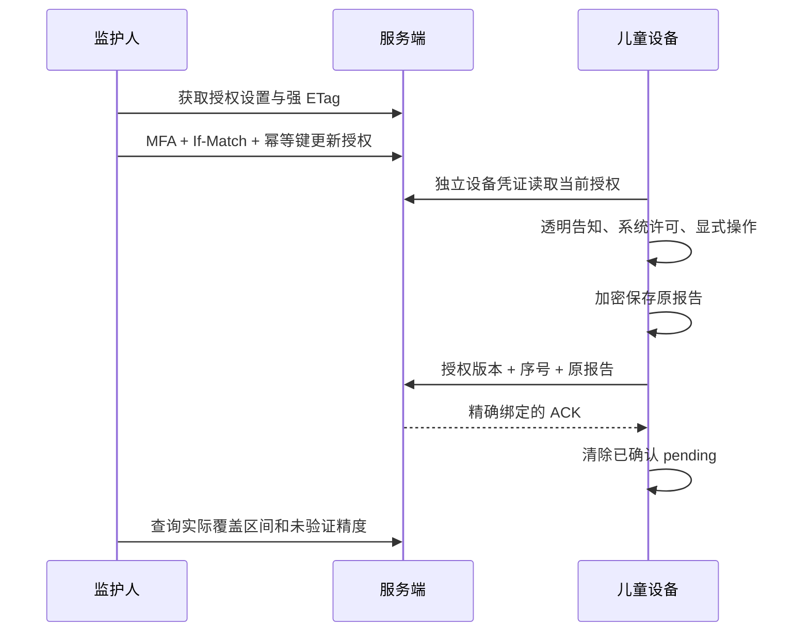

# V20 观察功能有序交付

## 1. 本次范围

承接已提交的 V13～V19 `60ce0e0`，增加7个观察领域类、2个清单授权接点、V20迁移和3份旅程/互通测试。儿童原生查询、加密持久协议和监护人观察模块已分别交付；本次补齐版本顺序和后端接口实现。

- 每注册周期分别授权应用清单/使用摘要，默认关闭。
- 监护人使用最近 MFA、强版本与幂等键修改授权；儿童不能修改。
- 设备凭证绑定租户、设备与注册，先持久后提交、精确 ACK、原请求重试。
- 撤回清理报告，重新授权不复活旧周期；注册撤销使凭证失效。
- 使用摘要明确为系统聚合/设备声明，不扣精准额度，不宣称系统强制执行。

## 2. 流程与接口

管理接口 `/api/v1/tenants/{tenantId}/devices/{deviceId}/observation-settings` 和 `usage-observations`；设备接口 `/api/v1/device-api/observation-settings`、`application-inventory`、`usage-observations`。正文、限制与错误码见 [后端契约](../device-observation-contract.md)，界面恢复见 [成人工作流](../device-observation-guardian-contract.md)。

## 3. 验证与复现

最终完整后端255项全部通过、0失败/错误/跳过并完成JAR打包；真实MySQL两阶段共26项通过。最终数据见 [候选指纹和检查结果](stage-v20-verification.json)。独立候选包含已提交前置版本与13份冻结增量，未加入通知/V21；其余339份客户端/后端/包源码与已提交基线逐文件相同。

后端验证必须显式设置 `device.dart.command`、`device.access.package`、`device.identity.package`、`device.policy.package`、`observation.device.package`、`observation.guardian.package`，并先准备相应 Dart/Flutter 依赖。不设置参数导致的跳过不得计为互通通过。运行 `mvn verify`，以退出0、实际报告零失败/错误/跳过和JAR指纹为准。

真实 MySQL 使用独立空白临时库，先运行 V19 TeacherAccessJourneyTest（11项），再运行 V20 InventoryJourneyTest、DeviceObservationJourneyTest、DeviceObservationHttpInteropTest（15项）。分别查询 Flyway history，严格确认连续版本1～19、1～20。测试数据库通过环境变量注入，不能在命令参数/文档中放密码，不能指向生产库。

真实 HTTP 使用生产 Spring安全链、Nimbus、Dart协议与独立进程；成人JWT/MFA、已激活设备与系统数据仍是明确夹具。Android实际加密进程检查是独立证据，见 [原生存储验收](../device-observation-native-persistence.md)，不能合称生产设备到云端全部认证。

两次 MySQL 失败定位到测试模拟Clock.millis的类型异常；用脱敏栈捕获后改为线程安全的具体Clock夹具，数据库流程再通过。未改变生产代码以绕过失败，失败日志保留在本机忽略目录。

## 4. 升级、回退与未完成门槛

先备份并核对迁移历史，按顺序应用 V13～V19 后再应用 V20。应用回退前关闭观察读写以及旧版应用清单入口，保留新增表；不回写已应用迁移，不自动删含数据表。全流程继续遵循后端契约的撤回与缓存边界。

MySQL 8.4仍产生当前Flyway仅认证到8.1的提示，不能用业务测试成功消除版本治理门槛。OceanBase、正式管理员OTP、实体手机/TV、EMM执行、可信精准计时、内容过滤、商业计费、容量和故障恢复均需独立完成。本阶段没有替换正在运行的协作服务，也不包含通知/V21。
